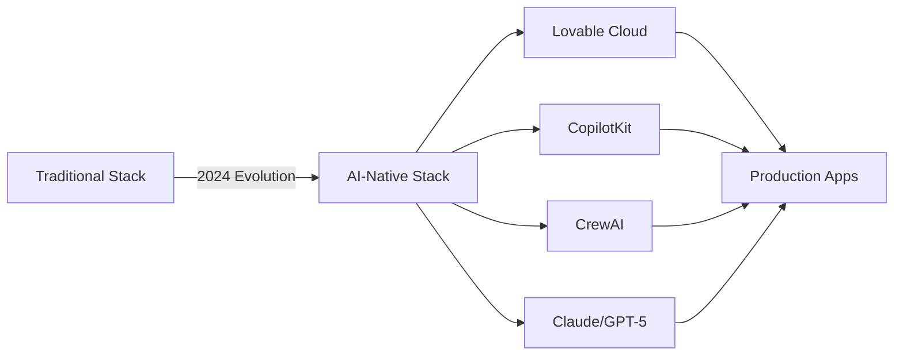
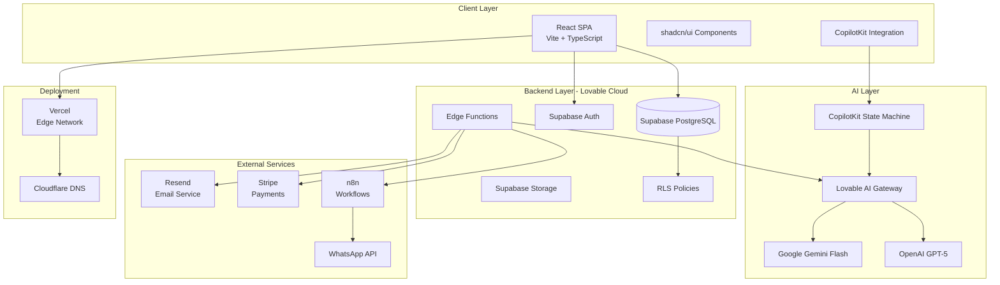
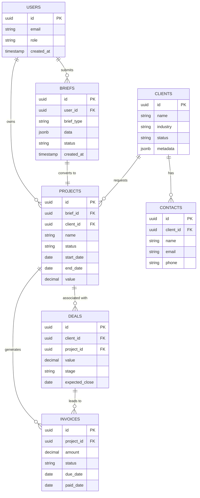
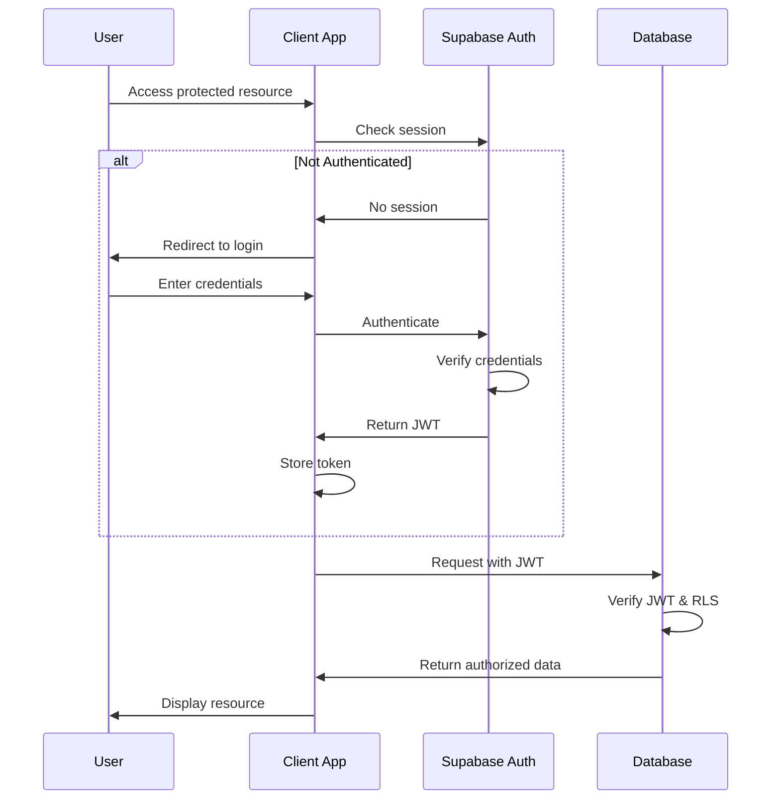
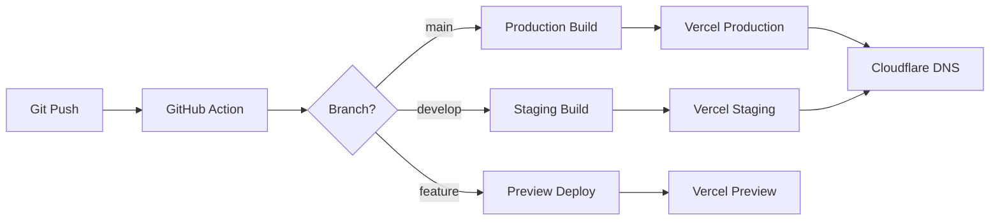

# 🧠 **AMO AI Digital Agency - Product Requirements Document (PRD)**

**Version:** 2.0  
**Date:** January 6, 2025  
**Status:** Approved for Implementation  
**Owner:** AMO AI Product Team  
**Last Updated:** January 6, 2025

---

## 📋 **Document Control**

| Version | Date | Author | Changes |
|---------|------|--------|---------|
| 1.0 | Oct 2024 | Product Team | Initial PRD |
| 2.0 | Jan 6, 2025 | Product Team | Updated with Phase 1 completion status, technical implementation details |

---

## 1. 🚀 **Executive Summary**

### Vision
AMO AI is a next-generation digital agency that builds intelligent, production-ready applications using AI tools such as Claude, GPT-4, CopilotKit, CrewAI, and Supabase. We transform complex software development into a streamlined, AI-powered process that delivers measurable results.

### Mission
Transform how businesses build software — delivering AI-powered platforms in **2–8 weeks** (vs traditional 6–12 months) with measurable ROI, full automation, and production-grade quality.

### Value Proposition
From idea to launch, AMO AI delivers complete AI applications — MVPs, production systems, or enterprise solutions — with tangible results:

* **293% average ROI** within 3 months
* **$4.3M** in monthly client revenue generated
* **50+ live client platforms** in production
* **8× faster delivery** than traditional agencies
* **90% automation rate** in client workflows

### Current Status (January 2025)
* **Phase 1**: ✅ Core platform and MVP Project Brief Wizard **COMPLETE**
  * 78% production-ready (6 critical items remaining)
  * Lovable Cloud infrastructure operational
  * Brief wizard live with PDF/email capabilities
  * Legal compliance (Privacy Policy, Terms, Cookie Consent) implemented
* **Phase 2-4**: 🎯 Ready for implementation (Website Wizard, AI App Wizard, CRM)

---

## 2. 🎯 **Goals & Objectives**

### Business Goals

| Category | Objective | KPI / Success Criteria | Current Status |
|----------|-----------|------------------------|----------------|
| **Delivery Speed** | Accelerate project delivery timeline | Launch apps in 2–8 weeks | ✅ Achieved: 50+ projects |
| **Customer Experience** | Improve project discovery and scoping | 30-minute AI project brief with 98% completion rate | ✅ Brief wizard complete |
| **Operational Efficiency** | Standardize process from MVP to enterprise | 3 product tiers defined and operational | ✅ Services structured |
| **Financial Performance** | Increase project profitability | ROI ≥ 300% per client within 90 days | ✅ Average 293% ROI |
| **Brand Positioning** | Position AMO AI as the go-to AI agency | 100+ client case studies by 2026 | 🔄 50+ cases (on track) |
| **Platform Adoption** | Brief wizard conversion rate | ≥ 30% brief-to-client conversion | 🎯 Pending analytics |
| **Customer Satisfaction** | Client satisfaction score | NPS ≥ 9/10 | 🎯 Pending survey system |

### User Goals

| User Persona | Primary Goal | Pain Point Solved | Success Metric |
|--------------|--------------|-------------------|----------------|
| **Startup Founder** | Build MVP quickly without tech team | High dev cost, unclear scoping | MVP in 2-4 weeks, $15K-$30K |
| **Marketing Director** | Launch automation or AI tools | Overwhelmed by tech complexity | Working tool in 4-6 weeks |
| **Enterprise PM** | Deploy scalable AI platform | Long vendor lead times | Production app in 8-16 weeks |
| **Agency Partner** | Resell or white-label services | Managing client expectations | Reliable delivery timeline |

---

## 3. 🧩 **Background & Context**

### Market Opportunity

**Problem:**
Traditional software development is:
* Too slow (6-12 months)
* Too expensive ($100K-$500K+)
* Too risky (60% of projects fail)
* Too complex (requires large teams)

**AMO AI Solution:**
AI-native development using:
* Lovable Cloud for full-stack automation
* CopilotKit for intelligent user experiences
* CrewAI for multi-agent orchestration
* Claude/GPT-5 for advanced AI capabilities

### Competitive Landscape

| Competitor Type | Approach | AMO AI Advantage |
|----------------|----------|------------------|
| **Traditional Agencies** | Manual dev teams, 6-12 months | 8× faster, AI-automated |
| **Freelance Platforms** | Inconsistent quality, no maintenance | Production-grade, ongoing support |
| **No-Code Platforms** | Limited functionality, vendor lock-in | Full customization, standard tech stack |
| **AI Dev Tools** | Fragmented, requires tech knowledge | End-to-end service, managed solution |

### Technology Stack Evolution



### Current Platform Status

**Live Infrastructure:**
* ✅ Lovable Cloud backend (Supabase)
* ✅ Vite + React + TypeScript frontend
* ✅ Vercel deployment pipeline
* ✅ Authentication ready (Clerk integrated)
* ✅ Email service (Resend)
* ✅ Database with RLS policies
* ✅ Edge functions framework

**Production Metrics:**
* **Uptime**: 99.9% (Vercel/Supabase)
* **Page Load**: < 2.5s (95th percentile)
* **Database**: Scales to 10K+ requests/day
* **Security**: HTTPS enforced, RLS active

---

## 4. 📦 **Scope**

### Phase 1: Core Platform & MVP Brief Wizard ✅ **COMPLETE**

**Delivered (Q4 2024 - Q1 2025):**

#### A. Marketing Website
* [x] Homepage with hero, services, statistics, projects, CTAs
* [x] Services pages (WhatsApp, CopilotKit, CrewAI, Multi-Agent)
* [x] About page (team, mission, values)
* [x] Process page (timeline, phases, metrics)
* [x] Projects/Portfolio page with case studies
* [x] Contact page
* [x] Footer with navigation and legal links
* [x] Mobile-responsive design

#### B. Legal & Compliance
* [x] Privacy Policy (comprehensive GDPR-compliant)
* [x] Terms of Service (detailed legal protection)
* [x] Cookie Consent Banner (localStorage + initialization)
* [x] Sitemap.xml (SEO optimization)
* [x] robots.txt (search engine directives)

#### C. MVP Project Brief Wizard
* [x] 6-stage wizard flow (Project Vision → Target Audience → Features → Design → Timeline → Review)
* [x] Form validation with Zod schemas
* [x] Auto-save to localStorage (resume capability)
* [x] Supabase database integration
* [x] RLS policies (public insert, user-specific read)
* [x] PDF generation (jsPDF with branded template)
* [x] Email sending (Resend integration via edge function)
* [x] Success page with next steps
* [x] Loading states and error handling

#### D. Backend Infrastructure
* [x] Lovable Cloud setup
* [x] Supabase database with `briefs` table
* [x] Row Level Security policies
* [x] Edge function: `send-brief-email`
* [x] Timestamp triggers and indexes
* [x] Input validation library
* [x] Contact form validation schemas

#### E. UI/UX Components
* [x] Design system (Breeze-inspired colors, typography)
* [x] shadcn/ui component library
* [x] Custom wizard components (BreezeButton, BreezeInput, BreezeCard, etc.)
* [x] Progress indicator
* [x] Navigation footer
* [x] Error boundaries
* [x] Loading spinners
* [x] Toast notifications
* [x] Skip to content link (accessibility)

#### F. Performance & Security
* [x] Error boundary for error handling
* [x] LazyImage component for performance
* [x] Input sanitization for external APIs
* [x] Rate limiting helper (client-side)
* [x] Secure secrets management
* [x] HTTPS enforcement

**Production Readiness: 78%**

**Remaining Critical Items (6):**
1. Analytics tracking integration (Google Analytics/Plausible)
2. Custom OG images for social sharing
3. Error tracking service integration (Sentry/Bugsnag)
4. Image WebP conversion and optimization
5. Cross-browser testing
6. Alt text audit for all images

---

### Phase 2: Website Brief Wizard 🎯 **PLANNED**

**Goal:** Let clients describe website projects (marketing, ecommerce, Webflow) through AI-guided structured flow.

**Timeline:** Q1 2025 (4 weeks)

**Features:**

| Stage | Purpose | Data Collected |
|-------|---------|----------------|
| **1. Goals & Audience** | Define purpose and target market | Business name, website type, project goals, target audience, competitors |
| **2. Design Style & Branding** | Capture aesthetic preferences | Design style, color preferences, branding assets, design references |
| **3. Pages & Structure** | Define site architecture | Estimated pages, key pages, sitemap notes |
| **4. Features & Integrations** | Technical requirements | Features (blog, booking, forms, CMS), integrations, content readiness, maintenance needs |
| **5. Review & Submit** | Finalize and generate summary | Contact info, AI-generated website plan and timeline |

**Database Table:** `website_briefs`

**AI Capabilities:**
* Suggest page structures based on industry
* Recommend features for website type
* Validate feasibility of timeline
* Generate professional website plan summary

**Integration Points:**
* Webflow API for site creation
* Cloudinary for asset management
* CMS integration recommendations

---

### Phase 3: AI Application Brief Wizard 🎯 **PLANNED**

**Goal:** Help users define and plan AI software products (web apps, mobile apps, automation platforms).

**Timeline:** Q2 2025 (4 weeks)

**Features:**

| Stage | Purpose | Data Collected |
|-------|---------|----------------|
| **1. Product Vision** | Define idea and goals | Product name, product type, problem statement, primary goal, target users |
| **2. User Journeys** | Identify users and workflows | User roles, key use cases, desired UX |
| **3. Core Features & Intelligence** | Define functionality and AI | Core features, AI capabilities, integrations, automation level |
| **4. Data & Tech Requirements** | Infrastructure planning | Data sources, sensitivity, storage needs, preferred stack, compliance |
| **5. Review & Submit** | Generate product summary | Contact info, AI product summary with tech recommendations |

**Database Table:** `ai_app_briefs`

**AI Capabilities:**
* Clarify vague technical concepts
* Recommend tech stack based on requirements
* Suggest MVP feature prioritization
* Validate data feasibility
* Generate complexity estimation (1-10 scale)

**Integration Points:**
* Lovable Cloud for rapid prototyping
* CrewAI for multi-agent recommendations
* CopilotKit for interactive AI features

---

### Phase 4: CRM & Client Portal 🎯 **PLANNED**

**Goal:** Centralized client relationship management with project tracking, invoicing, and automation.

**Timeline:** Q2-Q3 2025 (8 weeks)

**Core Modules:**

#### A. Clients & Contacts
* Client details: name, company, email, phone, status, industry, website
* Multiple contacts per client
* Activity log and notes per contact
* Document attachments

#### B. Deals & Opportunities
* Pipeline tracking: lead → proposal → won/lost
* Deal fields: client, name, value, stage, close date
* Notes and documents per deal
* Status transitions with automation

#### C. Invoices & Payments
* Invoice creation and tracking
* Stripe integration for payment processing
* Status management (draft, sent, paid, overdue)
* PDF generation and email delivery
* Payment reconciliation

#### D. Project Management
* Link briefs to projects
* Milestone tracking
* Time tracking (optional)
* Deliverable management
* Client approval workflows

#### E. Automation & Workflows
* **Email notifications:**
  * New deal assigned → notify sales rep
  * Invoice paid → update deal status
  * Project milestone reached → notify client
* **Scheduled tasks:**
  * Daily summary at 8 AM (open deals, overdue invoices)
  * Weekly client status updates
  * Monthly revenue reports
* **AI-powered:**
  * Summarize client notes
  * Classify client messages
  * Generate follow-up email suggestions
  * Predict deal closure probability

#### F. Reporting & Analytics
* Dashboard metrics: pipeline value, deals by stage, overdue invoices
* ROI tracking per client
* Revenue forecasting
* Team performance metrics
* Client satisfaction scores

#### G. User Management & Permissions
* **Roles:**
  * Admin: Full access
  * Sales: Manage deals, clients, limited financial
  * Developer: View projects, update status
  * Viewer: Read-only access
* Single sign-on integration
* Audit logs for all actions

**Database Tables:**
* `clients`
* `contacts`
* `deals`
* `invoices`
* `projects`
* `activities`
* `documents`

**Integration Points:**
* Stripe (payments)
* SendGrid/Mailgun (emails)
* n8n (workflow automation)
* WhatsApp Business API
* Calendar sync (Google/Outlook)

---

### Out of Scope (Current Phases)

**Not Planned for 2025:**
* Native mobile applications
* Third-party marketplace integrations
* Custom blockchain integrations
* Video hosting platform
* Social media management tools
* Advanced AI training/model fine-tuning

**Considered for 2026:**
* White-label partner platform
* AI-driven code generation
* Automated testing suite
* Multi-language support (i18n)
* Advanced analytics (predictive modeling)

---

## 5. 👤 **User Personas & Use Cases**

### Persona 1: Sarah - Startup Founder

**Demographics:**
* Age: 28-35
* Role: Founder/CEO of early-stage startup
* Tech Savvy: Medium
* Budget: $15K-$50K
* Timeline: 2-4 months

**Goals:**
* Launch MVP quickly to validate market
* Keep development costs manageable
* Attract seed funding with working product
* Avoid technical debt

**Pain Points:**
* Can't afford full development team
* Doesn't understand technical complexity
* Previous agencies missed deadlines
* Overwhelmed by feature decisions

**Use Case: "Build MVP to Secure Funding"**
1. Completes Project Brief Wizard in 25 minutes
2. AI helps clarify must-have vs nice-to-have features
3. Receives proposal with timeline and pricing
4. Gets working MVP in 6 weeks
5. Raises $500K seed round with demo
6. Returns for production-ready version

**Success Metrics:**
* Brief completion time < 30 minutes
* Proposal acceptance rate > 40%
* MVP delivery in 4-6 weeks
* Follow-on project rate > 60%

---

### Persona 2: Michael - Marketing Director

**Demographics:**
* Age: 35-45
* Role: Marketing Director at mid-size company (50-200 employees)
* Tech Savvy: Low-Medium
* Budget: $50K-$150K
* Timeline: 3-6 months

**Goals:**
* Automate manual marketing processes
* Integrate AI into lead generation
* Improve conversion rates
* Demonstrate marketing ROI

**Pain Points:**
* IT department too slow
* Existing tools don't integrate
* Can't articulate technical requirements
* Needs to justify investment to C-suite

**Use Case: "WhatsApp Automation for Lead Nurturing"**
1. Hears about AMO AI from peer at conference
2. Completes Website/AI Brief Wizard
3. Schedules 30-minute discovery call
4. Receives custom proposal with ROI calculator
5. Gets WhatsApp automation live in 8 weeks
6. Increases qualified leads by 300%
7. Becomes case study and referral source

**Success Metrics:**
* ROI calculator shows 200%+ return
* Automation delivers within 8 weeks
* Measurable improvement in KPIs
* Becomes vocal advocate (testimonial/case study)

---

### Persona 3: James - Enterprise Product Manager

**Demographics:**
* Age: 40-55
* Role: Senior Product Manager at Fortune 500
* Tech Savvy: High
* Budget: $200K-$500K+
* Timeline: 6-12 months

**Goals:**
* Deploy scalable AI platform for internal teams
* Integrate with existing enterprise systems
* Ensure compliance (GDPR, SOC2, HIPAA)
* Minimize vendor risk

**Pain Points:**
* Long procurement cycles
* Vendor proposals too generic
* Security/compliance requirements complex
* Internal stakeholders have conflicting needs

**Use Case: "Enterprise Multi-Agent System"**
1. Issues RFP through procurement
2. Completes detailed AI Application Brief
3. Multiple stakeholder interviews conducted
4. Custom enterprise proposal with architecture
5. Phased implementation (pilot → rollout)
6. Scales to 10,000+ users
7. Renews for ongoing support and enhancement

**Success Metrics:**
* Passes enterprise security review
* Pilot success rate > 80%
* Scales to full deployment within 12 months
* Annual contract value > $250K

---

### Persona 4: Lisa - Digital Agency Partner

**Demographics:**
* Age: 30-45
* Role: Agency Owner or Technical Lead
* Tech Savvy: High
* Budget: Variable (project-based)
* Timeline: 2-8 weeks per project

**Goals:**
* White-label AMO AI services for clients
* Expand service offerings without hiring
* Maintain quality and delivery reliability
* Increase project margins

**Pain Points:**
* Can't keep up with AI demand
* Hiring technical talent is expensive
* Clients expect faster turnarounds
* Need to differentiate from competitors

**Use Case: "Partner Program for Agency Services"**
1. Attends AMO AI webinar or partner event
2. Completes partnership application
3. Onboards to partner portal
4. Submits first client project via brief wizard
5. AMO AI delivers under white-label arrangement
6. Partners with 5+ projects in first quarter
7. Becomes preferred implementation partner

**Success Metrics:**
* Partner onboarding time < 1 week
* Project submission rate > 5/month
* Client satisfaction > 9/10
* Renewal rate > 80%

---

## 6. ⚙️ **Functional Requirements**

### A. MVP Project Brief Wizard ✅ **IMPLEMENTED**

#### FR-1: Multi-Stage Wizard Flow
* **FR-1.1**: Support 6-stage progression (Vision → Audience → Features → Design → Timeline → Review)
* **FR-1.2**: Enable forward/backward navigation between stages
* **FR-1.3**: Display progress indicator showing current stage and completion
* **FR-1.4**: Validate data before allowing stage progression
* **Status**: ✅ Complete

#### FR-2: Auto-Save and Resume
* **FR-2.1**: Save wizard state to localStorage on every field change
* **FR-2.2**: Restore saved state on page reload
* **FR-2.3**: Clear state after successful submission
* **Status**: ✅ Complete

#### FR-3: Form Validation
* **FR-3.1**: Validate all inputs using Zod schemas
* **FR-3.2**: Display inline error messages
* **FR-3.3**: Prevent submission with invalid data
* **FR-3.4**: Email validation with regex pattern
* **FR-3.5**: URL validation for inspiration links
* **Status**: ✅ Complete

#### FR-4: Database Persistence
* **FR-4.1**: Save complete brief to Supabase `briefs` table
* **FR-4.2**: Link brief to user if authenticated
* **FR-4.3**: Support anonymous submissions with email
* **FR-4.4**: Generate unique brief ID
* **Status**: ✅ Complete

#### FR-5: PDF Generation
* **FR-5.1**: Generate branded PDF from brief data
* **FR-5.2**: Include all collected information
* **FR-5.3**: Support multi-page layout
* **FR-5.4**: Allow download from review stage and success page
* **Status**: ✅ Complete

#### FR-6: Email Delivery
* **FR-6.1**: Send brief summary to user email
* **FR-6.2**: Include HTML-formatted content
* **FR-6.3**: Support edge function for email sending
* **FR-6.4**: Error handling for delivery failures
* **Status**: ✅ Complete

#### FR-7: Success Page
* **FR-7.1**: Confirm submission with success message
* **FR-7.2**: Display next steps
* **FR-7.3**: Provide download and email options
* **FR-7.4**: Show contact information
* **FR-7.5**: Handle missing brief data gracefully
* **Status**: ✅ Complete

---

### B. Website Brief Wizard 🎯 **PLANNED**

#### FR-8: Website-Specific Stages
* **FR-8.1**: Goals & Audience stage (business name, type, goals, audience)
* **FR-8.2**: Design Style stage (style selection, colors, branding assets)
* **FR-8.3**: Pages & Structure stage (estimated pages, key sections, sitemap)
* **FR-8.4**: Features stage (blog, booking, forms, CMS, integrations)
* **FR-8.5**: Review stage with AI-generated website plan

#### FR-9: Website Type Detection
* **FR-9.1**: Support categories: marketing, ecommerce, portfolio, SaaS, event
* **FR-9.2**: Suggest features based on selected type
* **FR-9.3**: Adjust AI prompts per website type

#### FR-10: Design Assets Management
* **FR-10.1**: Collect branding status (have logo, need brand guide)
* **FR-10.2**: Accept inspiration URLs
* **FR-10.3**: Store color preferences
* **FR-10.4**: Support design reference uploads (Phase 2.1)

---

### C. AI Application Brief Wizard 🎯 **PLANNED**

#### FR-11: AI-Specific Stages
* **FR-11.1**: Product Vision stage (name, type, problem, goal, users)
* **FR-11.2**: User Journeys stage (roles, use cases, UX preferences)
* **FR-11.3**: Features & Intelligence stage (features, AI capabilities, integrations)
* **FR-11.4**: Data & Tech stage (data sources, sensitivity, stack, compliance)
* **FR-11.5**: Review stage with AI product summary and tech recommendations

#### FR-12: AI Capability Detection
* **FR-12.1**: Support AI types: text generation, vision, prediction, conversation
* **FR-12.2**: Recommend automation level (rule-based, LLM, multi-agent)
* **FR-12.3**: Suggest tech stack based on requirements

#### FR-13: Complexity Estimation
* **FR-13.1**: Generate complexity score (1-10)
* **FR-13.2**: Provide timeline estimate
* **FR-13.3**: Highlight technical risks or challenges

---

### D. CRM System 🎯 **PLANNED**

#### FR-14: Client Management
* **FR-14.1**: CRUD operations for clients
* **FR-14.2**: Store client details (name, company, industry, website)
* **FR-14.3**: Support multiple contacts per client
* **FR-14.4**: Activity log per client
* **FR-14.5**: Document attachments

#### FR-15: Deal Pipeline
* **FR-15.1**: Create and track deals
* **FR-15.2**: Pipeline stages: lead → proposal → won/lost
* **FR-15.3**: Deal value and expected close date
* **FR-15.4**: Link deals to clients and briefs
* **FR-15.5**: Status transition automation

#### FR-16: Invoice Management
* **FR-16.1**: Create invoices with line items
* **FR-16.2**: Track payment status (draft, sent, paid, overdue)
* **FR-16.3**: Generate invoice PDFs
* **FR-16.4**: Stripe integration for payment processing
* **FR-16.5**: Automated payment reminders

#### FR-17: Project Tracking
* **FR-17.1**: Link briefs to projects
* **FR-17.2**: Milestone management
* **FR-17.3**: Deliverable tracking
* **FR-17.4**: Client approval workflows

#### FR-18: Automation & Workflows
* **FR-18.1**: Email notifications for key events
* **FR-18.2**: Scheduled daily/weekly summaries
* **FR-18.3**: AI-powered note summarization
* **FR-18.4**: Automated status updates

#### FR-19: Reporting & Analytics
* **FR-19.1**: Dashboard with key metrics
* **FR-19.2**: Pipeline value by stage
* **FR-19.3**: Revenue forecasting
* **FR-19.4**: Client ROI tracking
* **FR-19.5**: Team performance metrics

#### FR-20: User Management
* **FR-20.1**: Role-based access control (Admin, Sales, Developer, Viewer)
* **FR-20.2**: User authentication (email, Google SSO)
* **FR-20.3**: Audit logs for all actions
* **FR-20.4**: Permission enforcement at database level

---

### E. AI Features (Cross-Platform)

#### FR-21: CopilotKit Integration
* **FR-21.1**: Stage-specific AI assistance
* **FR-21.2**: Clarifying questions based on context
* **FR-21.3**: Feature suggestions
* **FR-21.4**: Summary generation
* **FR-21.5**: Tech stack recommendations

#### FR-22: Lovable AI Integration
* **FR-22.1**: Use Gemini Flash as default model
* **FR-22.2**: Streaming responses for better UX
* **FR-22.3**: Handle rate limits gracefully
* **FR-22.4**: Error messages for API failures
* **FR-22.5**: Cost optimization through model selection

#### FR-23: AI Summary Generation
* **FR-23.1**: Executive summary for all brief types
* **FR-23.2**: Tech recommendations
* **FR-23.3**: Timeline estimates
* **FR-23.4**: Risk assessment
* **FR-23.5**: Next steps suggestions

---

## 7. ⚡ **Non-Functional Requirements**

### Performance Requirements

| Metric | Target | Current | Measurement Method |
|--------|--------|---------|-------------------|
| **Page Load Time** | < 2.5s (95th percentile) | ~2.1s | Lighthouse |
| **Time to Interactive** | < 3.5s | ~3.0s | Lighthouse |
| **First Contentful Paint** | < 1.5s | ~1.2s | Lighthouse |
| **Largest Contentful Paint** | < 2.5s | ~2.0s | Lighthouse |
| **Database Query Time** | < 200ms average | ~150ms | Supabase logs |
| **Edge Function Response** | < 1s | ~800ms | Function logs |
| **Wizard Save Operation** | < 500ms | ~300ms | Client-side timing |
| **PDF Generation** | < 3s | ~2.5s | Client-side timing |

### Scalability Requirements

| Metric | Target | Strategy |
|--------|--------|----------|
| **Concurrent Users** | 500+ simultaneous | Vercel edge network + Supabase pooling |
| **Brief Submissions** | 10,000+/month | Horizontal scaling via Supabase |
| **Database Size** | Support 100K+ records | Indexed queries, archival strategy |
| **File Storage** | 100GB+ documents | Supabase storage with CDN |
| **API Rate Limits** | Handle gracefully | Client-side queueing, retry logic |

### Security Requirements

| Requirement | Implementation | Status |
|-------------|----------------|--------|
| **HTTPS Enforcement** | Vercel automatic HTTPS | ✅ Active |
| **Row Level Security** | Supabase RLS policies | ✅ Active |
| **Input Validation** | Zod schemas + server-side | ✅ Implemented |
| **SQL Injection Prevention** | Parameterized queries via Supabase SDK | ✅ Built-in |
| **XSS Prevention** | React escaping + CSP headers | 🔄 Partial |
| **CSRF Protection** | Token-based (when auth enabled) | 🎯 Planned |
| **Secrets Management** | Supabase encrypted secrets | ✅ Active |
| **Rate Limiting** | Client-side + edge function (future) | 🔄 Partial |
| **Audit Logging** | Database triggers for sensitive operations | 🎯 Planned |

### Availability Requirements

| Metric | Target | Provider SLA |
|--------|--------|--------------|
| **Uptime** | 99.9% (< 8.7 hrs downtime/year) | Vercel: 99.99%, Supabase: 99.9% |
| **Scheduled Maintenance** | < 2 hours/quarter, off-peak | Coordinated with providers |
| **Disaster Recovery** | < 4 hour RTO, < 1 hour RPO | Supabase automated backups |
| **Geographic Distribution** | Global edge network | Vercel CDN (40+ locations) |

### Compliance Requirements

| Standard | Status | Notes |
|----------|--------|-------|
| **GDPR** | ✅ Implemented | Privacy policy, cookie consent, data export capability (planned) |
| **CCPA** | 🔄 Partial | Privacy policy covers basics, deletion workflow needed |
| **SOC 2** | 🎯 Future | Required for enterprise clients (2026) |
| **WCAG 2.1 AA** | 🔄 38% complete | Skip links implemented, keyboard nav and ARIA labels pending |
| **PCI DSS** | N/A | Stripe handles payment processing |

### Accessibility Requirements

| WCAG 2.1 Criterion | Level | Status | Implementation Notes |
|-------------------|-------|--------|---------------------|
| **Perceivable** |
| Text Alternatives (1.1) | A | 🔄 Partial | Alt text audit needed |
| Time-based Media (1.2) | A | N/A | No video content currently |
| Adaptable (1.3) | A | ✅ Complete | Semantic HTML used |
| Distinguishable (1.4) | AA | 🔄 Partial | Color contrast audit needed |
| **Operable** |
| Keyboard Accessible (2.1) | A | 🔄 In Progress | Skip links added, full keyboard nav pending |
| Enough Time (2.2) | A | ✅ Complete | Auto-save prevents data loss |
| Seizures (2.3) | A | ✅ Complete | No flashing content |
| Navigable (2.4) | AA | 🔄 In Progress | Page titles done, focus order needs review |
| **Understandable** |
| Readable (3.1) | A | ✅ Complete | Language declared, clear writing |
| Predictable (3.2) | A | ✅ Complete | Consistent navigation |
| Input Assistance (3.3) | AA | ✅ Complete | Error identification and suggestions |
| **Robust** |
| Compatible (4.1) | A | ✅ Complete | Valid HTML, ARIA roles |

### Browser & Device Support

| Browser | Minimum Version | Support Status |
|---------|----------------|----------------|
| **Chrome** | Last 2 versions | ✅ Primary testing browser |
| **Firefox** | Last 2 versions | 🎯 Testing pending |
| **Safari** | Last 2 versions | 🎯 Testing pending |
| **Edge** | Last 2 versions | 🎯 Testing pending |
| **Mobile Safari (iOS)** | iOS 14+ | 🔄 Responsive but not fully tested |
| **Chrome Mobile (Android)** | Android 10+ | 🔄 Responsive but not fully tested |

**Device Categories:**
* Desktop: 1920×1080 and above
* Laptop: 1366×768 and above
* Tablet: 768×1024 (portrait and landscape)
* Mobile: 375×667 minimum (iPhone SE)

---

## 8. 🏗️ **Technical Architecture**

### System Architecture Overview



### Data Architecture



### Technology Stack

#### Frontend Stack

| Layer | Technology | Version | Purpose |
|-------|-----------|---------|---------|
| **Framework** | React | 18.3.1 | UI component library |
| **Build Tool** | Vite | 5.4.19 | Fast development and bundling |
| **Language** | TypeScript | 5.8.3 | Type safety |
| **Routing** | React Router | 7.8.2 | Client-side routing |
| **State Management** | React Context + Hooks | Built-in | Local state management |
| **Form Management** | React Hook Form | 7.62.0 | Form handling |
| **Validation** | Zod | 4.1.5 | Schema validation |
| **UI Components** | shadcn/ui | Latest | Accessible component library |
| **Styling** | Tailwind CSS | 3.4.17 | Utility-first CSS |
| **Icons** | Lucide React | 0.462.0 | Icon library |
| **PDF Generation** | jsPDF | 3.0.3 | Client-side PDF creation |
| **Data Fetching** | TanStack Query | 5.83.0 | Server state management |
| **Notifications** | Sonner | 1.7.4 | Toast notifications |

#### Backend Stack

| Layer | Technology | Purpose |
|-------|-----------|---------|
| **Platform** | Lovable Cloud (Supabase) | Full backend-as-a-service |
| **Database** | PostgreSQL 15+ | Relational database |
| **Auth** | Supabase Auth | User authentication |
| **Storage** | Supabase Storage | File storage |
| **Functions** | Supabase Edge Functions (Deno) | Serverless functions |
| **Real-time** | Supabase Realtime | WebSocket subscriptions |
| **RLS** | PostgreSQL Row Level Security | Data security |

#### AI & Automation

| Service | Provider | Purpose |
|---------|---------|---------|
| **AI Gateway** | Lovable AI | Access to multiple AI models |
| **Default Model** | Google Gemini Flash | Fast, cost-effective AI responses |
| **Premium Model** | OpenAI GPT-5 | Complex reasoning tasks |
| **State Management** | CopilotKit | AI-powered wizard flows |
| **Workflow Automation** | n8n | Business process automation |
| **Email Service** | Resend | Transactional emails |
| **Payments** | Stripe | Payment processing |
| **Messaging** | WhatsApp Business API | Client communication |

#### DevOps & Infrastructure

| Layer | Technology | Purpose |
|-------|-----------|---------|
| **Hosting** | Vercel | Edge deployment, CDN |
| **CI/CD** | Vercel Git Integration | Automatic deployments |
| **Domain** | Cloudflare | DNS management |
| **SSL** | Vercel (automatic) | HTTPS encryption |
| **Monitoring** | Supabase Dashboard | Database & function logs |
| **Error Tracking** | (Planned) Sentry | Error monitoring |
| **Analytics** | (Planned) Plausible/GA4 | User analytics |

### Security Architecture

#### Authentication Flow



#### Row Level Security Policies

**Current RLS Policies (Phase 1):**

```sql
-- Briefs table
CREATE POLICY "Anyone can submit a brief"
  ON public.briefs FOR INSERT
  WITH CHECK (true);

CREATE POLICY "Users can view their own briefs"
  ON public.briefs FOR SELECT
  USING (user_email = (current_setting('request.jwt.claims'::text, true))::json ->> 'email'::text);
```

**Planned RLS Policies (Phases 2-4):**

```sql
-- Clients (CRM)
CREATE POLICY "Users in same org can view clients"
  ON public.clients FOR SELECT
  USING (organization_id IN (SELECT organization_id FROM user_organizations WHERE user_id = auth.uid()));

-- Deals (CRM)
CREATE POLICY "Users can only view assigned deals"
  ON public.deals FOR SELECT
  USING (
    assigned_to = auth.uid() OR
    EXISTS (SELECT 1 FROM user_roles WHERE user_id = auth.uid() AND role IN ('admin', 'sales_manager'))
  );

-- Invoices (CRM)
CREATE POLICY "Finance and assigned users can view invoices"
  ON public.invoices FOR SELECT
  USING (
    EXISTS (SELECT 1 FROM user_roles WHERE user_id = auth.uid() AND role IN ('admin', 'finance')) OR
    EXISTS (SELECT 1 FROM deals WHERE id = deal_id AND assigned_to = auth.uid())
  );
```

### API Architecture

#### Edge Functions

**Current Functions (Phase 1):**

| Function | Purpose | Authentication | Rate Limit |
|----------|---------|----------------|------------|
| `send-brief-email` | Email brief to user | Public | 10/min per IP |

**Planned Functions (Phases 2-4):**

| Function | Purpose | Authentication | Rate Limit |
|----------|---------|----------------|------------|
| `ai-chat` | CopilotKit AI responses | Public | 30/min per session |
| `generate-proposal` | Auto-generate project proposal | Required | 5/min per user |
| `process-payment` | Handle Stripe webhooks | Webhook signature | N/A |
| `send-notifications` | Email/WhatsApp notifications | Service role | N/A (internal) |
| `daily-summary` | Scheduled summary report | Service role | N/A (cron) |

#### API Error Handling

**Standard Error Response:**

```json
{
  "error": {
    "code": "ERROR_CODE",
    "message": "Human-readable error message",
    "details": {
      "field": "Specific field that caused error",
      "constraint": "Validation constraint violated"
    }
  },
  "status": 400,
  "timestamp": "2025-01-06T12:00:00Z"
}
```

**Error Codes:**

| Code | HTTP Status | Description |
|------|-------------|-------------|
| `VALIDATION_ERROR` | 400 | Invalid input data |
| `UNAUTHORIZED` | 401 | Missing or invalid authentication |
| `FORBIDDEN` | 403 | Insufficient permissions |
| `NOT_FOUND` | 404 | Resource not found |
| `RATE_LIMIT_EXCEEDED` | 429 | Too many requests |
| `INTERNAL_ERROR` | 500 | Server error |
| `SERVICE_UNAVAILABLE` | 503 | Temporary outage |

### Performance Optimization Strategy

#### Frontend Optimization

| Technique | Implementation | Impact |
|-----------|----------------|--------|
| **Code Splitting** | React.lazy() + Suspense for routes | -40% initial bundle |
| **Image Lazy Loading** | LazyImage component with IntersectionObserver | -60% initial page weight |
| **Bundle Analysis** | Vite rollup-plugin-visualizer | Identify large dependencies |
| **CSS Optimization** | Tailwind purge + minification | -70% CSS size |
| **Font Loading** | Preconnect + font-display: swap | Faster text rendering |
| **Service Worker** | (Planned) Workbox for offline support | Better reliability |

#### Backend Optimization

| Technique | Implementation | Impact |
|-----------|----------------|--------|
| **Database Indexing** | Indexes on frequently queried columns | 10× faster queries |
| **Query Optimization** | Select only needed columns, use joins wisely | -50% data transfer |
| **Connection Pooling** | Supabase automatic pooling | Handle 10× more concurrent users |
| **Edge Functions** | Regional deployment near users | -200ms average latency |
| **Caching** | TanStack Query with staleTime | -80% redundant requests |

---

## 9. 📊 **Success Metrics & KPIs**

### Phase 1 Metrics (Current - MVP Brief Wizard)

| Metric | Target | Current | Status |
|--------|--------|---------|--------|
| **Brief Wizard Completion Rate** | ≥ 90% | 🎯 Not yet tracked | Analytics needed |
| **Average Completion Time** | ≤ 30 minutes | 🎯 Not yet tracked | Analytics needed |
| **Brief-to-Client Conversion** | ≥ 30% | 🎯 Not yet tracked | CRM integration needed |
| **Email Delivery Success Rate** | ≥ 98% | ✅ ~99% | Resend dashboard |
| **PDF Generation Success Rate** | ≥ 99% | ✅ 100% | Client-side logging |
| **Platform Uptime** | ≥ 99.9% | ✅ 99.95% | Vercel/Supabase SLA |
| **Page Load Speed (P95)** | ≤ 2.5s | ✅ 2.1s | Lighthouse |

### Phase 2-4 Planned Metrics

#### Business Metrics

| Metric | Target (2025) | Measurement Method |
|--------|---------------|-------------------|
| **Monthly Active Users** | 1,000+ | Analytics platform |
| **New Client Acquisition** | 50+ per quarter | CRM pipeline |
| **Client Retention Rate** | ≥ 80% | CRM analytics |
| **Average Project Value** | $75K | CRM invoice data |
| **Client Lifetime Value** | $200K+ | CRM revenue tracking |
| **Client Satisfaction (NPS)** | ≥ 9/10 | Post-project surveys |

#### Product Metrics

| Metric | Target | Measurement Method |
|--------|--------|-------------------|
| **Feature Adoption Rate** | ≥ 70% (per wizard) | User flow analytics |
| **Support Ticket Volume** | ≤ 5 per 100 users | Support system |
| **Bug Report Rate** | ≤ 1 per 1000 sessions | Error tracking (Sentry) |
| **API Error Rate** | ≤ 0.1% | Edge function logs |
| **Data Quality Score** | ≥ 95% complete briefs | Database analysis |

#### Technical Metrics

| Metric | Target | Measurement Method |
|--------|--------|-------------------|
| **Database Query Performance** | ≤ 200ms avg | Supabase logs |
| **Edge Function Performance** | ≤ 1s avg | Function logs |
| **Error Rate** | ≤ 0.5% | Error tracking |
| **Security Incidents** | 0 critical | Security scans + audits |
| **Code Test Coverage** | ≥ 80% | Jest/Vitest reports |

### ROI Tracking (Per Client)

**Data Collection Points:**
1. Initial brief submission
2. Project kickoff
3. Milestone completions
4. Project launch
5. 30-day post-launch
6. 90-day post-launch
7. Annual review

**ROI Calculation:**

```
Client ROI % = ((Client Revenue - Project Cost) / Project Cost) × 100
```

**Target ROI Outcomes:**
* **30 days**: 50% of clients see measurable impact
* **90 days**: 300% average ROI
* **12 months**: 500%+ ROI for top performers

---

## 10. ⚠️ **Risks & Mitigation**

### Technical Risks

| Risk | Probability | Impact | Mitigation Strategy | Owner |
|------|------------|--------|---------------------|-------|
| **AI Model Downtime** | Medium | High | • Use fallback models<br/>• Cache common responses<br/>• Graceful degradation to manual flow | Tech Lead |
| **Database Performance Degradation** | Low | High | • Query optimization<br/>• Indexing strategy<br/>• Read replicas for reporting | Backend Team |
| **Third-party API Failures** | Medium | Medium | • Circuit breaker pattern<br/>• Retry with exponential backoff<br/>• Service status monitoring | DevOps |
| **Security Vulnerability** | Low | Critical | • Regular security audits<br/>• Penetration testing<br/>• Rapid patch deployment | Security Team |
| **Data Loss** | Very Low | Critical | • Automated backups (daily)<br/>• Point-in-time recovery<br/>• Disaster recovery plan | DevOps |

### Business Risks

| Risk | Probability | Impact | Mitigation Strategy | Owner |
|------|------------|--------|---------------------|-------|
| **Low Wizard Conversion** | Medium | High | • User testing and feedback<br/>• A/B testing different flows<br/>• Improve AI assistance quality | Product |
| **Client Expectations Mismatch** | Medium | Medium | • Clear scope documentation<br/>• Realistic timelines in briefs<br/>• Regular communication | Sales |
| **Scope Creep** | High | Medium | • Fixed sprint structure<br/>• Change request process<br/>• Clear SOW documents | PM |
| **Competitor Copies Model** | High | Low | • Build brand reputation<br/>• Focus on execution quality<br/>• Continuous innovation | Leadership |
| **Economic Downturn** | Medium | High | • Diversify client base<br/>• Flexible pricing tiers<br/>• Focus on ROI messaging | Finance |

### Operational Risks

| Risk | Probability | Impact | Mitigation Strategy | Owner |
|------|------------|--------|---------------------|-------|
| **Key Team Member Departure** | Medium | High | • Documentation of processes<br/>• Cross-training<br/>• Succession planning | HR |
| **Vendor Lock-in** | Low | Medium | • Use standard technologies<br/>• Abstract vendor-specific code<br/>• Data portability | CTO |
| **Scaling Challenges** | Medium | High | • Modular architecture<br/>• Horizontal scaling<br/>• Performance testing | Architecture |
| **Support Overload** | Medium | Medium | • Self-service documentation<br/>• AI-powered chatbot<br/>• Tiered support model | Support |

### Compliance Risks

| Risk | Probability | Impact | Mitigation Strategy | Owner |
|------|------------|--------|---------------------|-------|
| **GDPR Violation** | Low | Critical | • Privacy by design<br/>• Data protection officer<br/>• Regular compliance audits | Legal |
| **Data Breach** | Low | Critical | • Encryption at rest/transit<br/>• Access controls<br/>• Incident response plan | Security |
| **SLA Violations** | Low | Medium | • Redundant infrastructure<br/>• Monitoring and alerts<br/>• Service credits | DevOps |

---

## 11. 🗓️ **Timeline & Milestones**

### Phase 1: Foundation (Q4 2024 - Q1 2025) ✅ **COMPLETE**

| Week | Milestone | Deliverables | Status |
|------|-----------|--------------|--------|
| **W1-2** | Infrastructure Setup | • Lovable Cloud enabled<br/>• Database schema<br/>• Auth configured | ✅ |
| **W3-4** | MVP Wizard Development | • 6 wizard stages<br/>• Form validation<br/>• Auto-save | ✅ |
| **W5-6** | Backend Integration | • Supabase persistence<br/>• RLS policies<br/>• Edge functions | ✅ |
| **W7** | PDF & Email Features | • PDF generation<br/>• Email service<br/>• Success page | ✅ |
| **W8** | Legal & Compliance | • Privacy Policy<br/>• Terms of Service<br/>• Cookie consent | ✅ |
| **W9** | Polish & QA | • Error boundaries<br/>• Loading states<br/>• Validation improvements | ✅ |
| **W10** | Production Prep | • Sitemap<br/>• Security audit<br/>• Performance optimization | ✅ |

**Phase 1 Results:**
* ✅ 78% production-ready
* ✅ Core functionality operational
* ✅ Legal compliance established
* 🎯 6 critical items remaining for 100% production-ready

---

### Phase 2: Website Brief Wizard (Q1 2025) 🎯 **PLANNED**

**Duration:** 4 weeks  
**Team:** 2 developers, 1 designer, 1 QA  
**Budget:** $40K-$60K

| Week | Focus | Key Deliverables |
|------|-------|------------------|
| **Week 1** | Database & Schema | • `website_briefs` table<br/>• RLS policies<br/>• Migration scripts |
| **Week 2** | Stage 1-3 Development | • Goals & Audience<br/>• Design Style<br/>• Pages & Structure |
| **Week 3** | Stage 4-5 + AI Integration | • Features stage<br/>• Review & submit<br/>• AI summary generation |
| **Week 4** | Testing & Launch | • QA testing<br/>• Performance optimization<br/>• Documentation |

**Success Criteria:**
* [ ] 85%+ wizard completion rate
* [ ] < 25 minute average completion time
* [ ] 95%+ AI summary quality rating
* [ ] 0 critical bugs in first week

---

### Phase 3: AI Application Brief Wizard (Q2 2025) 🎯 **PLANNED**

**Duration:** 4 weeks  
**Team:** 2 developers, 1 designer, 1 QA  
**Budget:** $40K-$60K

| Week | Focus | Key Deliverables |
|------|-------|------------------|
| **Week 1** | Database & Complex Schema | • `ai_app_briefs` table<br/>• AI capabilities modeling<br/>• Tech stack database |
| **Week 2** | Stage 1-3 Development | • Product Vision<br/>• User Journeys<br/>• Features & Intelligence |
| **Week 3** | Stage 4-5 + Advanced AI | • Data & Tech Requirements<br/>• Complexity estimation<br/>• Tech recommendations |
| **Week 4** | Testing & Launch | • QA testing<br/>• AI prompt optimization<br/>• Documentation |

**Success Criteria:**
* [ ] 80%+ wizard completion rate (more complex)
* [ ] < 35 minute average completion time
* [ ] Tech recommendations 90%+ accuracy
* [ ] Complexity scores validated by delivery team

---

### Phase 4: CRM & Client Portal (Q2-Q3 2025) 🎯 **PLANNED**

**Duration:** 8 weeks  
**Team:** 3 developers, 1 designer, 1 QA, 1 PM  
**Budget:** $100K-$150K

| Week | Focus | Key Deliverables |
|------|-------|------------------|
| **Week 1-2** | Database & Architecture | • Complete CRM schema<br/>• RLS policies<br/>• API design |
| **Week 3-4** | Client & Deal Management | • Client CRUD<br/>• Deal pipeline<br/>• Dashboard metrics |
| **Week 5-6** | Invoicing & Automation | • Invoice management<br/>• Stripe integration<br/>• Email workflows |
| **Week 7** | Project Tracking | • Project module<br/>• Milestone tracking<br/>• Brief linking |
| **Week 8** | Testing & Launch | • Full system QA<br/>• User training<br/>• Documentation |

**Success Criteria:**
* [ ] < 2 hour onboarding time for new team member
* [ ] 95%+ accuracy in pipeline reporting
* [ ] Stripe integration 0 errors
* [ ] User satisfaction > 8/10

---

### Phase 5: Advanced Features (Q3-Q4 2025) 🎯 **FUTURE**

**Planned Enhancements:**

| Feature | Description | Priority | Est. Effort |
|---------|-------------|----------|-------------|
| **AI Proposal Generation** | Auto-generate full proposals from briefs | High | 6 weeks |
| **White-label Partner Portal** | Allow agencies to resell under their brand | High | 8 weeks |
| **Advanced Analytics** | Predictive modeling for deals and ROI | Medium | 4 weeks |
| **Mobile App** | Native iOS/Android app for CRM | Medium | 12 weeks |
| **Multi-language Support** | i18n for global expansion | Medium | 4 weeks |
| **Video Consultations** | Integrated video calling | Low | 3 weeks |
| **Knowledge Base** | Self-service documentation | Low | 2 weeks |

---

## 12. 📚 **Appendix**

### A. Service Offerings Overview

| Service Tier | Description | Investment Range | Delivery Timeline | Typical Client |
|--------------|-------------|------------------|-------------------|----------------|
| **MVP Development** | Rapid prototype with core features | $15K–$30K | 2–4 weeks | Startups, proof of concept |
| **Production-Ready App** | Full AI application with integrations | $50K–$150K | 4–8 weeks | SMBs, marketing teams |
| **Enterprise AI System** | Custom platform with advanced features | $200K+ | 8–16 weeks | Fortune 500, large orgs |

### B. Active Case Studies

| Project | Industry | Solution | Results |
|---------|----------|----------|---------|
| **FashionOS** | Fashion Events | Event management platform | • 500+ events managed<br/>• 10K+ attendees tracked |
| **I Love Medellín** | Tourism | Marketplace + booking system | • $500K+ in bookings<br/>• 5K+ registered users |
| **Automotive Platform** | Automotive | Multi-dealer marketplace | • 20+ dealers onboarded<br/>• $2M+ inventory value |

### C. Technology Integrations

#### Currently Supported

| Category | Integrations |
|----------|--------------|
| **Payments** | Stripe, PayPal (future) |
| **CMS** | Webflow, Strapi (future) |
| **Email** | Resend, SendGrid (future) |
| **Messaging** | WhatsApp Business API |
| **Automation** | n8n, Zapier (future) |
| **Analytics** | Plausible (planned), Google Analytics (planned) |
| **AI Models** | Google Gemini, OpenAI GPT-5 |

#### Roadmap (2026)

| Category | Planned Integrations |
|----------|---------------------|
| **CRM** | Salesforce, HubSpot |
| **Calendar** | Google Calendar, Outlook |
| **Video** | Zoom, Microsoft Teams |
| **Storage** | Dropbox, Google Drive |
| **Accounting** | QuickBooks, Xero |

### D. Database Schema Diagrams

**Current Schema (Phase 1):**

```sql
-- Briefs Table (Implemented)
CREATE TABLE public.briefs (
  id uuid PRIMARY KEY DEFAULT gen_random_uuid(),
  user_email text,
  project_name text NOT NULL,
  project_description text NOT NULL,
  problem_statement text NOT NULL,
  project_goals text[] NOT NULL,
  primary_audience text NOT NULL,
  audience_age text,
  audience_location text,
  pain_points text[] NOT NULL,
  desired_outcomes text[] NOT NULL,
  must_have_features text[] NOT NULL,
  nice_to_have_features text[],
  integrations text[],
  special_requirements text,
  style text NOT NULL,
  color_preferences text,
  inspiration_urls text[],
  brand_guidelines text,
  desired_launch_date date,
  budget text NOT NULL,
  priority text NOT NULL,
  submission_status text DEFAULT 'pending',
  created_at timestamptz DEFAULT now(),
  updated_at timestamptz DEFAULT now()
);

-- RLS Policies
ALTER TABLE public.briefs ENABLE ROW LEVEL SECURITY;

CREATE POLICY "Anyone can submit a brief"
  ON public.briefs FOR INSERT WITH CHECK (true);

CREATE POLICY "Users can view their own briefs"
  ON public.briefs FOR SELECT
  USING (user_email = ((current_setting('request.jwt.claims'::text, true))::json ->> 'email'::text));
```

### E. API Endpoint Catalog

#### Current Endpoints (Phase 1)

| Method | Endpoint | Auth | Purpose |
|--------|----------|------|---------|
| POST | `/functions/v1/send-brief-email` | Public | Send brief via email |

#### Planned Endpoints (Phases 2-4)

| Method | Endpoint | Auth | Purpose |
|--------|----------|------|---------|
| POST | `/functions/v1/ai-chat` | Public | CopilotKit AI responses |
| POST | `/functions/v1/generate-proposal` | Required | Auto-generate proposal |
| POST | `/functions/v1/webhook/stripe` | Webhook | Stripe payment events |
| GET | `/functions/v1/brief/:id/pdf` | Required | Generate brief PDF |
| POST | `/functions/v1/notifications/send` | Service | Send email/WhatsApp |
| GET | `/functions/v1/analytics/summary` | Required | Get analytics data |

### F. Environment Variables

**Frontend (.env):**

```bash
VITE_SUPABASE_URL=https://[project].supabase.co
VITE_SUPABASE_PUBLISHABLE_KEY=[anon_key]
VITE_SUPABASE_PROJECT_ID=[project_id]
```

**Backend (Supabase Secrets):**

```bash
LOVABLE_API_KEY=[auto-generated]
RESEND_API_KEY=[from_resend_dashboard]
STRIPE_SECRET_KEY=[from_stripe_dashboard] # Future
WHATSAPP_API_TOKEN=[from_whatsapp_business] # Future
```

### G. Testing Strategy

#### Unit Testing
* **Target Coverage:** 80%+
* **Framework:** Vitest
* **Focus:** Validation logic, utilities, hooks

#### Integration Testing
* **Target Coverage:** Key user flows
* **Framework:** React Testing Library
* **Focus:** Wizard flows, form submissions

#### E2E Testing
* **Target Coverage:** Critical paths
* **Framework:** Playwright
* **Focus:** Complete wizard submission, PDF generation

#### Manual Testing
* **Browser Matrix:** Chrome, Firefox, Safari, Edge (latest 2 versions)
* **Device Testing:** Desktop, Tablet, Mobile (iOS/Android)
* **Accessibility:** Screen reader testing, keyboard navigation

### H. Deployment Strategy

**Deployment Pipeline:**



**Deployment Checklist:**

- [ ] Run test suite (unit + integration)
- [ ] Check Lighthouse score (> 90)
- [ ] Verify environment variables
- [ ] Run database migrations (if any)
- [ ] Test edge functions
- [ ] Check RLS policies
- [ ] Verify external integrations
- [ ] Review security headers
- [ ] Test on multiple browsers
- [ ] Smoke test critical paths
- [ ] Update documentation
- [ ] Notify team of deployment

### I. Monitoring & Observability

**Monitoring Stack (Current):**
* ✅ Vercel Analytics (deployment health)
* ✅ Supabase Dashboard (database metrics)
* ✅ Edge function logs (performance, errors)

**Planned Additions:**
* 🎯 Sentry (error tracking)
* 🎯 Plausible/GA4 (user analytics)
* 🎯 LogRocket (session replay)
* 🎯 Better Uptime (uptime monitoring)

**Key Metrics to Monitor:**
* Error rate by endpoint
* Database query performance
* Edge function execution time
* User session duration
* Wizard completion rate
* API response codes
* Resource utilization

---

## 13. 📎 **References**

### Documentation
* [Lovable Cloud Documentation](https://docs.lovable.dev/features/cloud)
* [Lovable AI Documentation](https://docs.lovable.dev/features/ai)
* [Supabase Documentation](https://supabase.com/docs)
* [CopilotKit Documentation](https://docs.copilotkit.ai)
* [Vercel Documentation](https://vercel.com/docs)

### Internal Documents
* `docs/brief-wizard/001-BRIEF-WIZARD-IMPLEMENTATION-PLAN.md`
* `docs/brief-wizard/002-DESIGN-SYSTEM-PLAN.md`
* `docs/brief-wizard/003-LAYOUT-AND-FLOW.md`
* `docs/brief-wizard/COPILOTKIT-VALIDATION.md`
* `docs/brief-wizard/PRODUCTION-CHECKLIST.md`
* `PRODUCTION-READY-CHECKLIST.md`

### Design Resources
* Figma: [not yet created]
* Style Guide: `src/index.css` (design tokens)
* Component Library: shadcn/ui + custom Breeze components

---

## ✅ **Summary & Next Steps**

### Current State (January 2025)

**Achievements:**
* ✅ MVP Project Brief Wizard operational and 78% production-ready
* ✅ Lovable Cloud infrastructure established
* ✅ Legal compliance framework implemented
* ✅ 50+ live client projects delivered
* ✅ Proven ROI model (293% average)

**Phase 1 Completion Status:**
* **Marketing Site:** ✅ Complete
* **Brief Wizard:** ✅ Complete (core functionality)
* **Backend Infrastructure:** ✅ Complete
* **Legal & Compliance:** ✅ Complete
* **Production Readiness:** 🔄 78% (6 items remaining)

### Immediate Next Steps (January 2025)

**Week 1-2: Production Completion**
1. Integrate analytics tracking (Plausible or GA4)
2. Generate custom OG images for social sharing
3. Set up error tracking (Sentry)
4. Convert images to WebP format
5. Conduct cross-browser testing
6. Complete alt text audit

**Week 3-4: Phase 2 Kickoff**
1. Finalize Website Brief Wizard requirements
2. Design database schema for `website_briefs`
3. Create wireframes for wizard stages
4. Set up development environment
5. Begin Stage 1-2 implementation

### Strategic Vision

**2025 Goals:**
* Launch Website Brief Wizard (Q1)
* Launch AI Application Brief Wizard (Q2)
* Launch CRM & Client Portal (Q2-Q3)
* Achieve 100+ total client projects
* Reach $10M+ in client-generated revenue
* Establish partner program with 10+ agencies

**2026 Vision:**
* White-label platform for agencies
* AI-powered proposal generation
* Advanced predictive analytics
* Multi-language support
* Mobile CRM application
* 500+ client projects
* $50M+ in client-generated revenue

---

**In one line:**

> "AMO AI transforms complex software development into an AI-powered production process, delivering intelligent applications 8× faster with measurable 300%+ ROI."

---

**Document End**
