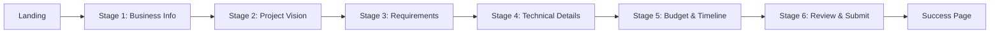

# 🎨 Brief Wizard Design System & UI/UX Plan
## Breeze-Inspired Style Guide

**Created**: January 2025  
**Status**: Design Specification  
**Version**: 1.0  
**Reference**: Breeze Style Guide

---

## 📋 TABLE OF CONTENTS

1. [Design Philosophy](#design-philosophy)
2. [Color System](#color-system)
3. [Typography](#typography)
4. [Spacing & Layout](#spacing--layout)
5. [Component Library](#component-library)
6. [Wizard User Journey](#wizard-user-journey)
7. [Stage Designs](#stage-designs)
8. [Responsive Behavior](#responsive-behavior)
9. [Implementation Checklist](#implementation-checklist)

---

## 🎯 DESIGN PHILOSOPHY

### Core Principles (Breeze-Inspired)

1. **Minimal & Clean**
   - Abundant white space
   - No unnecessary decoration
   - Focus on content hierarchy
   - Subtle shadows and borders

2. **Warm & Approachable**
   - Cream/beige background palette
   - Warm orange/coral accent color
   - Soft, rounded corners
   - Friendly, conversational copy

3. **Progressive Disclosure**
   - One question at a time
   - Clear progress indication
   - Contextual help when needed
   - No overwhelming forms

4. **Trust & Transparency**
   - Clear value proposition
   - Visible progress
   - Easy navigation back/forward
   - Save state automatically

---

## 🎨 COLOR SYSTEM

### Primary Palette

```css
:root {
  /* Base Colors - Warm Neutrals */
  --breeze-cream: #F5F3F0;           /* Main background */
  --breeze-cream-dark: #EBE8E3;      /* Hover states */
  --breeze-white: #FFFFFF;           /* Card backgrounds */
  
  /* Brand Orange - Primary CTA */
  --breeze-orange: #E8684A;          /* Primary buttons, links */
  --breeze-orange-hover: #D5593C;    /* Hover state */
  --breeze-orange-light: #FDEEE9;    /* Badges, highlights */
  
  /* Text Colors */
  --breeze-text-primary: #1A1A1A;    /* Headings */
  --breeze-text-secondary: #6B6B6B;  /* Body text */
  --breeze-text-tertiary: #999999;   /* Helper text */
  
  /* Borders & Dividers */
  --breeze-border: #E5E5E5;          /* Card borders */
  --breeze-border-light: #F0F0F0;    /* Subtle dividers */
  
  /* States */
  --breeze-success: #4CAF50;         /* Completed steps */
  --breeze-warning: #FF9800;         /* Validation warnings */
  --breeze-error: #F44336;           /* Error states */
  --breeze-info: #2196F3;            /* Info messages */
}
```

### Tailwind Config Integration

```typescript
// tailwind.config.ts
export default {
  theme: {
    extend: {
      colors: {
        breeze: {
          cream: {
            DEFAULT: 'hsl(30, 20%, 95%)',
            dark: 'hsl(30, 20%, 90%)',
          },
          orange: {
            DEFAULT: 'hsl(9, 73%, 60%)',
            hover: 'hsl(9, 73%, 53%)',
            light: 'hsl(9, 73%, 95%)',
          },
          text: {
            primary: 'hsl(0, 0%, 10%)',
            secondary: 'hsl(0, 0%, 42%)',
            tertiary: 'hsl(0, 0%, 60%)',
          },
          border: {
            DEFAULT: 'hsl(0, 0%, 90%)',
            light: 'hsl(0, 0%, 94%)',
          }
        }
      }
    }
  }
}
```

### Color Usage Guide

| Element | Color | Usage |
|---------|-------|-------|
| Page Background | `breeze-cream` | All wizard pages |
| Card Background | `breeze-white` | Form cards, content blocks |
| Primary CTA | `breeze-orange` | "Continue", "Submit" buttons |
| Secondary Button | `breeze-cream-dark` | "Back", "Skip" buttons |
| Headings | `breeze-text-primary` | H1, H2, H3 |
| Body Text | `breeze-text-secondary` | Paragraphs, labels |
| Helper Text | `breeze-text-tertiary` | Character counts, hints |
| Active Step | `breeze-orange` | Progress indicator |
| Completed Step | `breeze-success` | Checkmarks |
| Card Border | `breeze-border` | Subtle separation |

---

## ✍️ TYPOGRAPHY

### Font Family

**Primary**: Inter (Google Fonts)
- Clean, modern, highly legible
- Excellent at all sizes
- Wide range of weights

**Fallback**: system-ui, -apple-system, sans-serif

### Font Scale

```css
/* Headings */
--text-6xl: 3.75rem;   /* 60px - Page hero */
--text-5xl: 3rem;      /* 48px - Main headings */
--text-4xl: 2.25rem;   /* 36px - Section headings */
--text-3xl: 1.875rem;  /* 30px - Card headings */
--text-2xl: 1.5rem;    /* 24px - Subheadings */
--text-xl: 1.25rem;    /* 20px - Large body */

/* Body */
--text-base: 1rem;     /* 16px - Body text */
--text-sm: 0.875rem;   /* 14px - Helper text */
--text-xs: 0.75rem;    /* 12px - Captions */

/* Line Heights */
--leading-tight: 1.2;   /* Headings */
--leading-normal: 1.5;  /* Body text */
--leading-relaxed: 1.75; /* Large paragraphs */

/* Font Weights */
--font-normal: 400;
--font-medium: 500;
--font-semibold: 600;
--font-bold: 700;
```

### Typography Usage

```tsx
// Wizard Page Title
<h1 className="text-5xl font-bold text-breeze-text-primary leading-tight mb-3">
  Tell us about your project
</h1>

// Stage Subtitle
<p className="text-xl text-breeze-text-secondary leading-relaxed mb-8">
  This helps us understand your goals and recommend the best solutions
</p>

// Form Label
<label className="text-sm font-medium text-breeze-text-primary mb-2">
  Project Name
</label>

// Helper Text
<p className="text-sm text-breeze-text-tertiary mt-1">
  This will be visible to potential agencies
</p>
```

---

## 📐 SPACING & LAYOUT

### Spacing Scale (8px base)

```css
--space-0: 0;
--space-1: 0.25rem;  /* 4px */
--space-2: 0.5rem;   /* 8px */
--space-3: 0.75rem;  /* 12px */
--space-4: 1rem;     /* 16px */
--space-6: 1.5rem;   /* 24px */
--space-8: 2rem;     /* 32px */
--space-12: 3rem;    /* 48px */
--space-16: 4rem;    /* 64px */
--space-24: 6rem;    /* 96px */
```

### Layout Grid

```tsx
// Desktop Container
<div className="max-w-4xl mx-auto px-6 py-12">
  {/* Wizard content - 896px max width */}
</div>

// Mobile Container
<div className="max-w-full mx-auto px-4 py-6">
  {/* Wizard content - Full width with padding */}
</div>

// Two-Column Layout (Review Stage)
<div className="grid grid-cols-1 lg:grid-cols-2 gap-8">
  <div>{/* Left column */}</div>
  <div>{/* Right column - summary */}</div>
</div>
```

### Card Spacing

```tsx
<Card className="p-8 mb-6 rounded-2xl border border-breeze-border shadow-sm">
  <CardContent className="space-y-6">
    {/* Form fields with consistent spacing */}
  </CardContent>
</Card>
```

### Vertical Rhythm

- **Between sections**: `mb-12` (48px)
- **Between cards**: `mb-6` (24px)
- **Between form fields**: `space-y-4` (16px)
- **Label to input**: `mb-2` (8px)
- **Input to helper text**: `mt-1` (4px)

---

## 🧩 COMPONENT LIBRARY

### 1. Progress Stepper

**Design**: Horizontal dots with active state

```tsx
<div className="flex items-center justify-center gap-3 mb-12">
  {stages.map((stage, index) => (
    <div key={stage}>
      {/* Completed */}
      {index < currentStage && (
        <div className="w-3 h-3 rounded-full bg-breeze-success" />
      )}
      
      {/* Active */}
      {index === currentStage && (
        <div className="w-4 h-4 rounded-full bg-breeze-orange" />
      )}
      
      {/* Upcoming */}
      {index > currentStage && (
        <div className="w-3 h-3 rounded-full bg-breeze-border" />
      )}
      
      {/* Connector line */}
      {index < stages.length - 1 && (
        <div className="w-8 h-0.5 bg-breeze-border-light" />
      )}
    </div>
  ))}
</div>

{/* Stage indicator text */}
<p className="text-sm text-breeze-text-tertiary text-center mb-8">
  Step {currentStage + 1} of {totalStages}
</p>
```

### 2. Primary Button (CTA)

```tsx
<Button className="
  bg-breeze-orange 
  hover:bg-breeze-orange-hover 
  text-white 
  font-medium 
  px-8 
  py-4 
  rounded-full 
  text-base
  transition-all 
  duration-200 
  shadow-md 
  hover:shadow-lg
  disabled:opacity-50 
  disabled:cursor-not-allowed
">
  Continue
</Button>
```

### 3. Secondary Button

```tsx
<Button className="
  bg-breeze-cream-dark 
  hover:bg-breeze-border 
  text-breeze-text-primary 
  font-medium 
  px-8 
  py-4 
  rounded-full 
  text-base
  transition-all 
  duration-200
  border 
  border-breeze-border
">
  Back
</Button>
```

### 4. Input Field

```tsx
<div className="space-y-2">
  <Label className="text-sm font-medium text-breeze-text-primary">
    Project Name
  </Label>
  <Input 
    className="
      border-breeze-border 
      rounded-xl 
      px-4 
      py-3 
      text-base
      focus:border-breeze-orange 
      focus:ring-2 
      focus:ring-breeze-orange/20
      transition-all
    "
    placeholder="e.g., E-commerce Platform Redesign"
  />
  <p className="text-sm text-breeze-text-tertiary">
    50 characters remaining
  </p>
</div>
```

### 5. Textarea

```tsx
<Textarea 
  className="
    border-breeze-border 
    rounded-xl 
    px-4 
    py-3 
    text-base
    min-h-[120px]
    focus:border-breeze-orange 
    focus:ring-2 
    focus:ring-breeze-orange/20
    transition-all
  "
  placeholder="Describe your project goals..."
/>
```

### 6. Selection Card (for multiple choice)

```tsx
<div className="grid grid-cols-1 md:grid-cols-2 gap-4">
  {options.map((option) => (
    <button
      key={option.id}
      className={cn(
        "p-6 rounded-xl border-2 text-left transition-all",
        "hover:border-breeze-orange hover:shadow-md",
        selected === option.id 
          ? "border-breeze-orange bg-breeze-orange-light" 
          : "border-breeze-border bg-white"
      )}
    >
      <div className="flex items-start gap-3">
        <option.icon className="w-6 h-6 text-breeze-orange" />
        <div>
          <h3 className="font-semibold text-breeze-text-primary mb-1">
            {option.title}
          </h3>
          <p className="text-sm text-breeze-text-secondary">
            {option.description}
          </p>
        </div>
      </div>
    </button>
  ))}
</div>
```

### 7. Info Badge

```tsx
<div className="
  inline-flex 
  items-center 
  gap-2 
  px-4 
  py-2 
  rounded-full 
  bg-breeze-orange-light 
  text-breeze-orange 
  text-sm 
  font-medium
">
  <Sparkles className="w-4 h-4" />
  <span>AI-Assisted</span>
</div>
```

### 8. Help Tooltip

```tsx
<Tooltip>
  <TooltipTrigger>
    <HelpCircle className="w-4 h-4 text-breeze-text-tertiary" />
  </TooltipTrigger>
  <TooltipContent className="
    bg-breeze-text-primary 
    text-white 
    px-4 
    py-2 
    rounded-lg 
    text-sm 
    max-w-xs
  ">
    This helps us match you with the right agencies
  </TooltipContent>
</Tooltip>
```

### 9. Navigation Footer

```tsx
<div className="
  fixed 
  bottom-0 
  left-0 
  right-0 
  bg-white 
  border-t 
  border-breeze-border 
  py-4 
  px-6
  z-50
">
  <div className="max-w-4xl mx-auto flex items-center justify-between">
    <Button variant="secondary" disabled={isFirstStage}>
      ← Back
    </Button>
    
    <div className="text-sm text-breeze-text-tertiary">
      Auto-saved
    </div>
    
    <Button disabled={!canAdvance()}>
      Continue →
    </Button>
  </div>
</div>
```

---

## 🗺️ WIZARD USER JOURNEY

### Entry Points

1. **Homepage Hero** → "Start Your AI Brief" CTA
2. **Services Pages** → "Get Custom Brief" button
3. **Navigation Menu** → "AI Brief" link
4. **Contact Page** → "Create Brief Instead" option

### Pre-Wizard Landing Page

**Route**: `/brief-collection`

**Purpose**: Build trust and set expectations before starting

**Layout**:
```
┌─────────────────────────────────────┐
│           HERO SECTION              │
│  "AI-Powered Project Discovery"     │
│  [Start Brief] [Book Call Instead]  │
└─────────────────────────────────────┘
┌─────────────────────────────────────┐
│         HOW IT WORKS (3 STEPS)      │
│  [Answer Questions] [AI Analysis]   │
│         [Get Recommendations]        │
└─────────────────────────────────────┘
┌─────────────────────────────────────┐
│         TRUST INDICATORS            │
│  ⏱️ 15-20 min  |  💾 Auto-saved     │
│  🤖 AI-Guided  |  🔒 100% Private    │
└─────────────────────────────────────┘
```

### Wizard Flow (6 Stages)



### Exit Points

- ❌ **Abandon**: Save draft, email recovery link
- 💾 **Save for Later**: Create account (optional), email link
- ✅ **Complete**: Download PDF, book consultation, view matches

---

## 🎨 STAGE DESIGNS

### Stage 1: Business Information

**Goal**: Collect basic company details

**Layout**:
```
┌────────────────────────────────────┐
│  Progress: ●○○○○○  (Step 1 of 6)  │
└────────────────────────────────────┘

   Let's start with your business
   Tell us about your company so we can
   understand your context

┌────────────────────────────────────┐
│  Company Name *                     │
│  [________________________]         │
│  This will be visible to agencies   │
│                                     │
│  Industry *                         │
│  [Select industry ▼]                │
│                                     │
│  Company Size                       │
│  [○ 1-10] [○ 11-50] [○ 51-200]    │
│  [○ 201-500] [○ 500+]              │
│                                     │
│  Website (Optional)                 │
│  [________________________]         │
└────────────────────────────────────┘

       [Back]    Auto-saved    [Continue →]
```

**AI Assistance**:
- Suggest industry based on company name
- Auto-fill website if found
- Recommend similar successful projects

### Stage 2: Project Vision

**Goal**: Understand project goals and pain points

**Layout**:
```
┌────────────────────────────────────┐
│  Progress: ●●○○○○  (Step 2 of 6)  │
└────────────────────────────────────┘

   What are you looking to build?
   Help us understand your vision

┌────────────────────────────────────┐
│  Project Type *                     │
│                                     │
│  [📱 Mobile App     ] [selected]   │
│  Native iOS/Android experience      │
│                                     │
│  [🌐 Web Platform   ]              │
│  Browser-based application          │
│                                     │
│  [🤖 AI Solution    ]              │
│  ML/AI powered features             │
│                                     │
│  [🔧 Integration    ]              │
│  Connect existing systems           │
└────────────────────────────────────┘

┌────────────────────────────────────┐
│  Project Description *              │
│  [                                 ]│
│  [  Describe what you want to     ]│
│  [  build and why...              ]│
│  [                                 ]│
│                                     │
│  💡 AI Suggestion:                  │
│  Based on "e-commerce" + "mobile"   │
│  Consider: Payment integration,     │
│  inventory management, push notif.  │
│  [Apply Suggestions]                │
└────────────────────────────────────┘

       [← Back]  Auto-saved  [Continue →]
```

**AI Assistance**:
- Generate project description from keywords
- Suggest features based on project type
- Show similar project examples
- Estimate complexity automatically

### Stage 3: Requirements & Features

**Goal**: Define specific features and requirements

**Layout**:
```
┌────────────────────────────────────┐
│  Progress: ●●●○○○  (Step 3 of 6)  │
└────────────────────────────────────┘

   What features do you need?
   Select all that apply

┌────────────────────────────────────┐
│  🔐 User Authentication             │
│  [✓] User registration & login      │
│  [✓] Social login (Google, Apple)   │
│  [ ] Two-factor authentication      │
│  [ ] Single sign-on (SSO)           │
│                                     │
│  💳 Payments & Transactions         │
│  [✓] Payment processing             │
│  [✓] Subscription management        │
│  [ ] Multi-currency support         │
│  [ ] Invoice generation             │
│                                     │
│  📊 Analytics & Reporting           │
│  [ ] User analytics dashboard       │
│  [ ] Custom reports                 │
│  [ ] Data export                    │
│                                     │
│  🤖 AI Features (New!)              │
│  [✓] AI chatbot support             │
│  [ ] Content recommendations        │
│  [ ] Automated workflows            │
│  [ ] Predictive analytics           │
└────────────────────────────────────┘

┌────────────────────────────────────┐
│  🎯 Must-Have Features              │
│  [x] Payment processing             │
│  [x] User authentication            │
│  [Add more...]                      │
│                                     │
│  ✨ Nice-to-Have Features           │
│  [x] Push notifications             │
│  [Add more...]                      │
└────────────────────────────────────┘

       [← Back]  Auto-saved  [Continue →]
```

**AI Assistance**:
- Recommend features based on project type
- Flag missing critical features
- Estimate development time per feature
- Suggest MVP vs full scope

### Stage 4: Technical Details

**Goal**: Understand technical preferences and constraints

**Layout**:
```
┌────────────────────────────────────┐
│  Progress: ●●●●○○  (Step 4 of 6)  │
└────────────────────────────────────┘

   Technical preferences
   This helps us match you with the right
   expertise

┌────────────────────────────────────┐
│  Existing Systems to Integrate      │
│                                     │
│  [+ Add System]                     │
│                                     │
│  Selected: 2 systems                │
│  • Stripe (Payments)       [Remove] │
│  • Salesforce (CRM)        [Remove] │
│                                     │
│  💡 AI detected from description:   │
│  • Shopify                 [Add]    │
│  • Google Analytics        [Add]    │
└────────────────────────────────────┘

┌────────────────────────────────────┐
│  Preferred Technologies (Optional)  │
│                                     │
│  Frontend                           │
│  [React] [Vue] [Angular] [Other]   │
│                                     │
│  Backend                            │
│  [Node.js] [Python] [Ruby] [Other] │
│                                     │
│  Database                           │
│  [PostgreSQL] [MongoDB] [MySQL]    │
│                                     │
│  Cloud Provider                     │
│  [AWS] [Google Cloud] [Azure]      │
│                                     │
│  [ ] No preference - recommend best │
│      stack for my needs             │
└────────────────────────────────────┘

┌────────────────────────────────────┐
│  Compliance Requirements            │
│  [ ] GDPR (EU data protection)      │
│  [ ] HIPAA (Healthcare)             │
│  [ ] SOC 2                          │
│  [ ] PCI DSS (Payment card)         │
│  [ ] None                           │
└────────────────────────────────────┘

       [← Back]  Auto-saved  [Continue →]
```

**AI Assistance**:
- Detect integrations from project description
- Recommend tech stack based on requirements
- Flag potential compliance needs
- Suggest scalability considerations

### Stage 5: Budget & Timeline

**Goal**: Set realistic expectations

**Layout**:
```
┌────────────────────────────────────┐
│  Progress: ●●●●●○  (Step 5 of 6)  │
└────────────────────────────────────┘

   Budget & Timeline
   Help us find agencies within your range

┌────────────────────────────────────┐
│  Project Budget (USD) *             │
│                                     │
│  [○] $10K - $25K    Startup MVP     │
│  [●] $25K - $50K    Small Business  │
│  [○] $50K - $100K   Growth Stage    │
│  [○] $100K - $250K  Enterprise      │
│  [○] $250K+         Large Scale     │
│                                     │
│  Or specify exact range:            │
│  Min: [$25,000] Max: [$50,000]     │
└────────────────────────────────────┘

┌────────────────────────────────────┐
│  🤖 AI Budget Estimate              │
│  Based on your requirements:        │
│                                     │
│  Estimated: $45,000 - $65,000       │
│  Timeline: 12-16 weeks              │
│                                     │
│  Breakdown:                         │
│  • User Auth & Backend   $8K-10K    │
│  • Payment Integration   $5K-7K     │
│  • Mobile Apps (iOS+Android) $20K   │
│  • AI Features           $8K-12K    │
│  • Testing & Deployment  $4K-6K     │
│                                     │
│  💡 Your selected $25K-$50K is      │
│  slightly below estimate. Consider: │
│  • Starting with MVP features       │
│  • Phased development               │
│  • Single platform first            │
└────────────────────────────────────┘

┌────────────────────────────────────┐
│  Desired Timeline *                 │
│                                     │
│  Start Date                         │
│  [📅 Select date ▼] Flexible       │
│                                     │
│  Target Launch                      │
│  [○] 4-6 weeks    Fast track        │
│  [●] 8-12 weeks   Standard          │
│  [○] 3-6 months   Complex           │
│  [○] 6+ months    Enterprise        │
│  [○] Flexible     Quality first     │
└────────────────────────────────────┘

┌────────────────────────────────────┐
│  💰 Payment Structure Preference    │
│  [✓] Milestone-based                │
│  [✓] Monthly retainer               │
│  [ ] Hourly rate                    │
│  [ ] Fixed price                    │
└────────────────────────────────────┘

       [← Back]  Auto-saved  [Continue →]
```

**AI Assistance**:
- Calculate budget estimate from requirements
- Show breakdown by feature
- Flag budget vs scope mismatches
- Suggest timeline based on complexity
- Recommend MVP if budget tight

### Stage 6: Review & Submit

**Goal**: Confirm all details before submission

**Layout** (Two-column):
```
┌────────────────────────────────────┐
│  Progress: ●●●●●●  (Step 6 of 6)  │
└────────────────────────────────────┘

   Review your project brief
   Check everything looks good

LEFT COLUMN:                RIGHT COLUMN:
┌─────────────────────┐    ┌─────────────────┐
│ 🏢 Business Info    │    │  📊 Summary     │
│                     │    │                 │
│ • TechCorp Inc      │    │ Est. Budget     │
│ • E-commerce        │    │ $45K - $65K     │
│ • 11-50 employees   │    │                 │
│ [Edit]              │    │ Timeline        │
└─────────────────────┘    │ 12-16 weeks     │
                           │                 │
┌─────────────────────┐    │ Features        │
│ 🎯 Project Vision   │    │ 12 selected     │
│                     │    │                 │
│ Mobile E-commerce   │    │ Complexity      │
│ Platform with AI... │    │ ●●●●○ High      │
│ [Read more...]      │    │                 │
│ [Edit]              │    │ Match Score     │
└─────────────────────┘    │ 87% excellent   │
                           │                 │
┌─────────────────────┐    │ 🎉 Ready to     │
│ ⚙️ Technical        │    │ find agencies!  │
│                     │    │                 │
│ • React Native      │    │ We've matched   │
│ • Node.js API       │    │ you with 12     │
│ • PostgreSQL        │    │ qualified       │
│ • Stripe, Shopify   │    │ agencies        │
│ [Edit]              │    │                 │
└─────────────────────┘    └─────────────────┘

┌─────────────────────┐
│ 💰 Budget & Timeline│
│                     │
│ • $25K - $50K       │
│ • 8-12 weeks        │
│ • Flexible start    │
│ [Edit]              │
└─────────────────────┘

┌──────────────────────────────────┐
│  📧 Delivery Options              │
│                                   │
│  Where should we send your brief? │
│  Email: [____________________]    │
│                                   │
│  [✓] Email PDF copy               │
│  [✓] Get agency recommendations   │
│  [✓] Schedule consultation call   │
│                                   │
│  [ ] Create account (optional)    │
│      Save briefs, track agencies  │
│      Email: [________________]    │
│      Password: [____________]     │
└──────────────────────────────────┘

┌──────────────────────────────────┐
│  [← Back to Budget]               │
│                                   │
│  [📥 Download PDF] [🚀 Submit →]  │
└──────────────────────────────────┘
```

**AI Assistance**:
- Calculate match score
- Show number of matching agencies
- Highlight any missing critical info
- Generate PDF preview
- Suggest improvements

### Success Page

**Route**: `/brief-collection/success`

**Layout**:
```
┌────────────────────────────────────┐
│           ✅ Success!               │
│                                     │
│  Your project brief is ready        │
│  We've analyzed your requirements   │
│  and found 12 qualified agencies    │
└────────────────────────────────────┘

┌────────────────────────────────────┐
│  📊 Your Brief Summary              │
│                                     │
│  • Project: Mobile E-commerce       │
│  • Budget: $25K-$50K                │
│  • Timeline: 8-12 weeks             │
│  • Complexity: High                 │
└────────────────────────────────────┘

┌────────────────────────────────────┐
│  Next Steps                         │
│                                     │
│  1. [📥 Download PDF Brief]         │
│     Share with your team            │
│                                     │
│  2. [👥 View Agency Matches]        │
│     12 agencies match your needs    │
│                                     │
│  3. [📞 Schedule Consultation]      │
│     Free 30-min strategy call       │
│                                     │
│  4. [💾 Save to Dashboard]          │
│     Create account to track         │
└────────────────────────────────────┘

┌────────────────────────────────────┐
│  📧 Check your email                │
│  We've sent your brief to           │
│  user@email.com                     │
│                                     │
│  [Resend Email]                     │
└────────────────────────────────────┘

         [← Back to Home]
```

---

## 📱 RESPONSIVE BEHAVIOR

### Breakpoints

```css
/* Mobile First Approach */
--mobile: 0px;        /* 320px - 767px */
--tablet: 768px;      /* 768px - 1023px */
--desktop: 1024px;    /* 1024px+ */
--wide: 1440px;       /* 1440px+ */
```

### Mobile Adaptations (< 768px)

1. **Single Column Layout**
   - Stack all elements vertically
   - Full-width cards
   - Larger touch targets (min 44px)

2. **Simplified Navigation**
   - Sticky bottom nav bar
   - Back button top-left
   - Progress dots at top

3. **Typography Scale Down**
   - H1: 36px → 28px
   - H2: 24px → 20px
   - Body: 16px (maintain)
   - Padding: 24px → 16px

4. **Form Adjustments**
   - Full-width inputs
   - Larger tap areas
   - Native mobile keyboards
   - Autocomplete optimized

5. **Hidden Elements**
   - Hide AI assistance sidebar on mobile
   - Show as expandable drawer instead
   - Collapse help text by default

### Tablet Adaptations (768px - 1023px)

1. **Hybrid Layout**
   - Use full desktop width
   - Stack cards when needed
   - Side-by-side selection cards

2. **Navigation**
   - Desktop-style header
   - Full button labels
   - Hover states enabled

### Desktop Optimizations (1024px+)

1. **Fixed Sidebar** (optional)
   - AI assistance always visible
   - Progress timeline on left
   - Main content centered

2. **Wider Forms**
   - Multi-column grids
   - Inline labels where appropriate
   - Keyboard shortcuts

3. **Enhanced Interactions**
   - Hover previews
   - Tooltips on hover
   - Keyboard navigation
   - Auto-focus on load

---

## ✅ IMPLEMENTATION CHECKLIST

### Phase 1: Design System Setup (2 hours)

- [ ] Update `index.css` with Breeze color variables
- [ ] Configure `tailwind.config.ts` with custom colors
- [ ] Add Inter font from Google Fonts to `index.html`
- [ ] Create design token documentation
- [ ] Build Storybook/documentation page

### Phase 2: Component Library (4 hours)

- [ ] Create `WizardProgress.tsx` component
- [ ] Create `BreezeButton.tsx` (primary/secondary variants)
- [ ] Create `BreezeInput.tsx` with helper text
- [ ] Create `BreezeTextarea.tsx`
- [ ] Create `BreezeCard.tsx` wrapper
- [ ] Create `SelectionCard.tsx` for multiple choice
- [ ] Create `NavigationFooter.tsx` sticky bottom bar
- [ ] Create `InfoBadge.tsx` component
- [ ] Create `AIAssistantPanel.tsx` sidebar

### Phase 3: Landing Page (2 hours)

- [ ] Design `/brief-collection` landing page
- [ ] Add hero section with value prop
- [ ] Add "How it Works" visual flow
- [ ] Add trust indicators section
- [ ] Add testimonials (if available)
- [ ] Mobile responsive check
- [ ] Add CTA buttons with proper routes

### Phase 4: Wizard Pages (8 hours)

- [ ] Stage 1: Business Information page
- [ ] Stage 2: Project Vision page
- [ ] Stage 3: Requirements page
- [ ] Stage 4: Technical Details page
- [ ] Stage 5: Budget & Timeline page
- [ ] Stage 6: Review & Submit page
- [ ] Success page with next steps
- [ ] Error states for all forms

### Phase 5: AI Integration (4 hours)

- [ ] AI suggestion panels
- [ ] Budget calculator UI
- [ ] Feature recommendations
- [ ] Auto-fill functionality
- [ ] Match score display
- [ ] Progress tracking

### Phase 6: Responsive Polish (3 hours)

- [ ] Test on iPhone SE (375px)
- [ ] Test on iPad (768px)
- [ ] Test on desktop (1440px)
- [ ] Fix mobile navigation
- [ ] Optimize touch targets
- [ ] Test form keyboard flow

### Phase 7: Animations & Micro-interactions (2 hours)

- [ ] Page transition animations
- [ ] Button hover effects
- [ ] Form field focus states
- [ ] Progress indicator animation
- [ ] Success confetti/celebration
- [ ] Loading skeletons

### Phase 8: Accessibility (2 hours)

- [ ] Keyboard navigation
- [ ] Screen reader labels
- [ ] Focus indicators
- [ ] Color contrast check (WCAG AA)
- [ ] Form error announcements
- [ ] Skip links

---

## 📊 DESIGN METRICS

### Performance Goals

- **Lighthouse Score**: > 90
- **First Contentful Paint**: < 1.5s
- **Time to Interactive**: < 3s
- **Largest Contentful Paint**: < 2.5s

### UX Goals

- **Time to Complete**: 10-15 minutes
- **Abandonment Rate**: < 20%
- **Mobile Completion**: > 60%
- **AI Interaction**: > 50% use suggestions

### Accessibility Goals

- **WCAG Level**: AA compliance
- **Keyboard Navigation**: 100% functional
- **Screen Reader**: Fully accessible
- **Color Contrast**: 4.5:1 minimum

---

## 🎨 DESIGN ASSETS NEEDED

### Illustrations

1. **Landing Page Hero**
   - Custom illustration of wizard/AI interaction
   - 800x600px, PNG with transparency
   - Breeze color palette

2. **Success State**
   - Celebration illustration
   - 400x400px

3. **Empty States**
   - No saved briefs
   - No results found

### Icons

- Lucide React icons (already installed)
- Custom icons for:
  - Project types (8 icons)
  - Feature categories (12 icons)
  - Tech stack logos (20+ logos)

### Photography

- Real agency-client collaboration photos
- Warm, professional aesthetic
- Diverse representation
- 1920x1080px for hero images

---

## 📝 COPY GUIDELINES

### Tone of Voice

- **Friendly**: Conversational, not corporate
- **Confident**: "We'll help you..." not "We can try..."
- **Clear**: No jargon unless necessary
- **Encouraging**: Positive reinforcement
- **Transparent**: Honest about timelines/costs

### Microcopy Examples

**Button Labels**:
- ✅ "Continue to Budget" (specific)
- ❌ "Next" (vague)

**Helper Text**:
- ✅ "This helps us find agencies in your budget range"
- ❌ "Required field"

**Error Messages**:
- ✅ "Project name should be at least 3 characters. Try something like 'Mobile App Redesign'"
- ❌ "Invalid input"

**Success Messages**:
- ✅ "Great! Your brief is ready. We found 12 agencies that match perfectly."
- ❌ "Success"

---

## 🔧 TECHNICAL NOTES

### CSS Architecture

```scss
// Use CSS custom properties for all colors
.breeze-button {
  background: var(--breeze-orange);
  color: white;
  border-radius: 9999px; // Full rounded
  padding: 1rem 2rem;
  font-weight: 500;
  
  &:hover {
    background: var(--breeze-orange-hover);
    box-shadow: var(--shadow-md);
  }
  
  &:disabled {
    opacity: 0.5;
    cursor: not-allowed;
  }
}
```

### Animation Library

Use Framer Motion for page transitions:

```tsx
import { motion } from 'framer-motion';

<motion.div
  initial={{ opacity: 0, y: 20 }}
  animate={{ opacity: 1, y: 0 }}
  exit={{ opacity: 0, y: -20 }}
  transition={{ duration: 0.3 }}
>
  {/* Stage content */}
</motion.div>
```

---

## ✅ FINAL CHECKLIST

### Design Approval
- [ ] Style guide reviewed and approved
- [ ] Color palette tested in light/dark mode
- [ ] Typography hierarchy validated
- [ ] Component library complete
- [ ] Responsive mockups created

### Development Ready
- [ ] All assets exported
- [ ] Icon library documented
- [ ] Animation specs defined
- [ ] Copy deck finalized
- [ ] Design tokens in Figma/code

### Launch Ready
- [ ] A/B testing plan
- [ ] Analytics tracking setup
- [ ] User testing completed
- [ ] Accessibility audit passed
- [ ] Performance benchmarks met

---

**Status**: ✅ Design System Ready for Implementation  
**Next**: Begin Phase 1 - Design System Setup  
**Timeline**: 27 hours total development time  
**Priority**: High - Foundation for entire wizard experience
