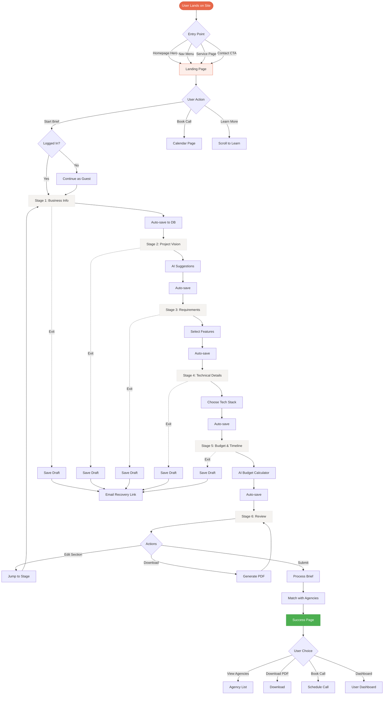

# 🗺️ Brief Wizard Layout & User Flow
## Visual Structure & Navigation Design

**Created**: January 2025  
**Status**: Layout Specification  
**Version**: 1.0  
**Companion**: 002-DESIGN-SYSTEM-PLAN.md

---

## 📋 TABLE OF CONTENTS

1. [Page Templates](#page-templates)
2. [User Flow Diagram](#user-flow-diagram)
3. [Stage Wireframes](#stage-wireframes)
4. [Navigation Patterns](#navigation-patterns)
5. [Responsive Layouts](#responsive-layouts)
6. [Interactive States](#interactive-states)

---

## 📐 PAGE TEMPLATES

### Template 1: Standard Wizard Stage

```
┌─────────────────────────────────────────────────────────────┐
│  Header (Fixed)                                             │
│  [AMO AI Logo]                     [Save Draft] [Exit]     │
└─────────────────────────────────────────────────────────────┘

┌─────────────────────────────────────────────────────────────┐
│  Progress Indicator (Centered)                              │
│  ●●●○○○                        Step 3 of 6                  │
└─────────────────────────────────────────────────────────────┘

                    ┌────────────────┐
                    │  AI Assistant  │ (Floating, right side)
                    │  💬 Need help? │
                    │  [Chat icon]   │
                    └────────────────┘

┌─────────────────────────────────────────────────────────────┐
│  Main Content Area (max-w-4xl, centered)                    │
│                                                              │
│  [Stage Title - Large, Bold]                                │
│  Stage subtitle - explains what we're collecting            │
│                                                              │
│  ┌──────────────────────────────────────────────────────┐  │
│  │  Card 1: Primary Input Section                       │  │
│  │  [Form fields, inputs, selects]                      │  │
│  └──────────────────────────────────────────────────────┘  │
│                                                              │
│  ┌──────────────────────────────────────────────────────┐  │
│  │  Card 2: Additional Options                          │  │
│  │  [Secondary inputs or selections]                    │  │
│  └──────────────────────────────────────────────────────┘  │
│                                                              │
│  [Helper text, tips, examples]                              │
│                                                              │
│  <!-- 80px bottom padding for sticky footer -->            │
└─────────────────────────────────────────────────────────────┘

┌─────────────────────────────────────────────────────────────┐
│  Navigation Footer (Fixed Bottom)                           │
│  [← Back]           Auto-saved 2 min ago       [Continue →]│
└─────────────────────────────────────────────────────────────┘
```

### Template 2: Review Stage (Two-Column)

```
┌─────────────────────────────────────────────────────────────┐
│  Header                                                      │
└─────────────────────────────────────────────────────────────┘

┌─────────────────────────────────────────────────────────────┐
│  Progress: ●●●●●●                    Step 6 of 6            │
└─────────────────────────────────────────────────────────────┘

┌─────────────────────────────────────────────────────────────┐
│  Review Your Project Brief                                  │
│  Make sure everything looks good before submitting          │
│                                                              │
│  ┌─────────────────────────┐  ┌──────────────────────────┐ │
│  │ LEFT COLUMN             │  │ RIGHT SIDEBAR            │ │
│  │                         │  │                          │ │
│  │ ┌─────────────────────┐ │  │ 📊 Brief Summary        │ │
│  │ │ Business Info       │ │  │                          │ │
│  │ │ • Company           │ │  │ Est. Budget:            │ │
│  │ │ • Industry          │ │  │ $45K - $65K             │ │
│  │ │ [Edit]              │ │  │                          │ │
│  │ └─────────────────────┘ │  │ Timeline:               │ │
│  │                         │  │ 12-16 weeks             │ │
│  │ ┌─────────────────────┐ │  │                          │ │
│  │ │ Project Vision      │ │  │ Features: 12            │ │
│  │ │ • Type              │ │  │ Integrations: 3         │ │
│  │ │ • Description       │ │  │                          │ │
│  │ │ [Edit]              │ │  │ Match Score:            │ │
│  │ └─────────────────────┘ │  │ 87% Excellent ✨        │ │
│  │                         │  │                          │ │
│  │ [More sections...]      │  │ 🎯 12 agencies          │ │
│  │                         │  │ matched!                │ │
│  │                         │  │                          │ │
│  └─────────────────────────┘  └──────────────────────────┘ │
│                                                              │
│  ┌──────────────────────────────────────────────────────┐  │
│  │ 📧 Email: [____________]  [✓] Get recommendations    │  │
│  │ [Download PDF]            [🚀 Submit Brief →]         │  │
│  └──────────────────────────────────────────────────────┘  │
└─────────────────────────────────────────────────────────────┘
```

### Template 3: Landing Page

```
┌─────────────────────────────────────────────────────────────┐
│  [Logo]                          [Login]  [Sign Up]         │
└─────────────────────────────────────────────────────────────┘

┌─────────────────────────────────────────────────────────────┐
│                         HERO SECTION                         │
│                                                              │
│              AI-Powered Project Brief Creation              │
│                                                              │
│     Get matched with top agencies in 15 minutes with our    │
│              intelligent discovery process                   │
│                                                              │
│         [🚀 Start Your Brief]  [📞 Book a Call]            │
│                                                              │
│         ⏱️ 15-20 min  |  💾 Auto-saved  |  🤖 AI-Guided    │
└─────────────────────────────────────────────────────────────┘

┌─────────────────────────────────────────────────────────────┐
│                    HOW IT WORKS (3 Steps)                    │
│                                                              │
│  ┌──────────────┐  ┌──────────────┐  ┌──────────────┐     │
│  │ 1. Answer    │  │ 2. AI        │  │ 3. Get       │     │
│  │ Questions    │  │ Analysis     │  │ Matches      │     │
│  │              │→ │              │→ │              │     │
│  │ Tell us your │  │ We analyze & │  │ Receive      │     │
│  │ needs        │  │ estimate     │  │ proposals    │     │
│  └──────────────┘  └──────────────┘  └──────────────┘     │
└─────────────────────────────────────────────────────────────┘

┌─────────────────────────────────────────────────────────────┐
│                    TRUST INDICATORS                          │
│  ┌──────────────────────────────────────────────────────┐  │
│  │  ✅ 293% Average ROI  |  ⏱️ 2-8 Week Delivery        │  │
│  │  🏆 100% Success Rate |  🔒 100% Confidential        │  │
│  └──────────────────────────────────────────────────────┘  │
└─────────────────────────────────────────────────────────────┘

┌─────────────────────────────────────────────────────────────┐
│                   WHAT YOU'LL GET                            │
│  • Detailed project brief PDF                               │
│  • Budget & timeline estimates                              │
│  • Technology recommendations                               │
│  • Custom agency matches                                    │
│  • Free consultation call                                   │
└─────────────────────────────────────────────────────────────┘

┌─────────────────────────────────────────────────────────────┐
│                      TESTIMONIALS                            │
│  [Customer quotes with photos]                              │
└─────────────────────────────────────────────────────────────┘

┌─────────────────────────────────────────────────────────────┐
│                    FINAL CTA SECTION                         │
│         Ready to find your perfect agency partner?          │
│              [🚀 Start Your Brief Now]                      │
└─────────────────────────────────────────────────────────────┘
```

---

## 🔄 USER FLOW DIAGRAM



---

## 🖼️ STAGE WIREFRAMES

### Stage 1: Business Information

```
╔═══════════════════════════════════════════════════════════╗
║                  ●○○○○○  Step 1 of 6                      ║
╚═══════════════════════════════════════════════════════════╝

                Let's start with your business
            Tell us about your company so we can understand
                          your context

╔═══════════════════════════════════════════════════════════╗
║                                                            ║
║  Company Name *                                            ║
║  ┌──────────────────────────────────────────────────┐    ║
║  │                                                   │    ║
║  └──────────────────────────────────────────────────┘    ║
║  This will be visible to agencies you connect with        ║
║                                                            ║
║  Industry *                                                ║
║  ┌──────────────────────────────────────────────────┐    ║
║  │ Select industry ▼                                 │    ║
║  └──────────────────────────────────────────────────┘    ║
║                                                            ║
║  Company Size                                              ║
║  ┌──────┐ ┌──────┐ ┌──────┐ ┌──────┐ ┌──────┐          ║
║  │ 1-10 │ │11-50 │ │51-200│ │201+  │ │500+  │          ║
║  └──────┘ └──────┘ └──────┘ └──────┘ └──────┘          ║
║                                                            ║
║  Website (Optional)                                        ║
║  ┌──────────────────────────────────────────────────┐    ║
║  │ https://                                          │    ║
║  └──────────────────────────────────────────────────┘    ║
║  We'll use this to better understand your brand           ║
║                                                            ║
║  Contact Email *                                           ║
║  ┌──────────────────────────────────────────────────┐    ║
║  │                                                   │    ║
║  └──────────────────────────────────────────────────┘    ║
║  Where should we send your completed brief?               ║
║                                                            ║
╚═══════════════════════════════════════════════════════════╝

╔═══════════════════════════════════════════════════════════╗
║  [       Back       ]    Auto-saved    [ Continue →     ] ║
║     (disabled)                            (active)         ║
╚═══════════════════════════════════════════════════════════╝
```

### Stage 2: Project Vision (Interactive)

```
╔═══════════════════════════════════════════════════════════╗
║                  ●●○○○○  Step 2 of 6                      ║
╚═══════════════════════════════════════════════════════════╝

              What are you looking to build?
            Help us understand your vision and goals

╔═══════════════════════════════════════════════════════════╗
║  Project Type * (Select one)                               ║
║                                                            ║
║  ┌─────────────────────┐  ┌─────────────────────┐        ║
║  │ 📱 Mobile App       │  │ 🌐 Web Platform     │        ║
║  │                     │  │                     │        ║
║  │ Native iOS/Android  │  │ Browser-based SaaS  │        ║
║  │ or cross-platform   │  │ or web application  │        ║
║  └─────────────────────┘  └─────────────────────┘        ║
║             [SELECTED]                                     ║
║                                                            ║
║  ┌─────────────────────┐  ┌─────────────────────┐        ║
║  │ 🤖 AI Solution      │  │ 🔧 Integration      │        ║
║  │                     │  │                     │        ║
║  │ ML/AI powered       │  │ Connect existing    │        ║
║  │ features or agents  │  │ systems or APIs     │        ║
║  └─────────────────────┘  └─────────────────────┘        ║
║                                                            ║
║  ┌─────────────────────┐  ┌─────────────────────┐        ║
║  │ 💼 Enterprise       │  │ 🎨 Custom Solution  │        ║
║  │                     │  │                     │        ║
║  │ Large-scale system  │  │ Something unique    │        ║
║  │ or infrastructure   │  │ or specialized      │        ║
║  └─────────────────────┘  └─────────────────────┘        ║
╚═══════════════════════════════════════════════════════════╝

╔═══════════════════════════════════════════════════════════╗
║  Project Name *                                            ║
║  ┌──────────────────────────────────────────────────┐    ║
║  │ Mobile E-commerce Platform                        │    ║
║  └──────────────────────────────────────────────────┘    ║
║  47/100 characters                                         ║
╚═══════════════════════════════════════════════════════════╝

╔═══════════════════════════════════════════════════════════╗
║  Project Description *                                     ║
║  ┌──────────────────────────────────────────────────┐    ║
║  │ We need a mobile shopping app that integrates    │    ║
║  │ with our existing Shopify store. Must include    │    ║
║  │ payment processing, push notifications, and      │    ║
║  │ AI-powered product recommendations...            │    ║
║  │                                                   │    ║
║  │                                                   │    ║
║  └──────────────────────────────────────────────────┘    ║
║  245/500 characters · Clear and detailed ✓                ║
║                                                            ║
║  ┌────────────────────────────────────────────────────┐  ║
║  │ 💡 AI Suggestions based on your description:       │  ║
║  │                                                     │  ║
║  │ • Payment gateway integration (Stripe)             │  ║
║  │ • Product catalog management                       │  ║
║  │ • User authentication & profiles                   │  ║
║  │ • Shopping cart & checkout flow                    │  ║
║  │ • Push notification system                         │  ║
║  │                                                     │  ║
║  │ [← Add All]  [Add Selected]  [Customize →]        │  ║
║  └────────────────────────────────────────────────────┘  ║
╚═══════════════════════════════════════════════════════════╝

╔═══════════════════════════════════════════════════════════╗
║  [ ← Back to Business ]  Auto-saved  [ Continue to        ║
║                                        Requirements →    ] ║
╚═══════════════════════════════════════════════════════════╝
```

### Stage 3: Requirements & Features (Expandable)

```
╔═══════════════════════════════════════════════════════════╗
║                  ●●●○○○  Step 3 of 6                      ║
╚═══════════════════════════════════════════════════════════╝

              What features do you need?
         Select all that apply. We can refine later.

╔═══════════════════════════════════════════════════════════╗
║  🔐 User Authentication & Security                         ║
║  ▼ [Click to expand]                                       ║
║                                                            ║
║    [✓] User registration & login                          ║
║    [✓] Social login (Google, Apple, Facebook)             ║
║    [ ] Two-factor authentication (2FA)                     ║
║    [ ] Single sign-on (SSO)                                ║
║    [ ] Role-based access control                           ║
║    [✓] Password reset & recovery                          ║
╚═══════════════════════════════════════════════════════════╝

╔═══════════════════════════════════════════════════════════╗
║  💳 Payments & Transactions                                ║
║  ▼ [Click to expand]                                       ║
║                                                            ║
║    [✓] Payment processing (credit cards)                  ║
║    [✓] Multiple payment methods                           ║
║    [ ] Subscription & recurring billing                    ║
║    [ ] Multi-currency support                              ║
║    [ ] Refunds & chargebacks                               ║
║    [✓] Payment receipts & invoices                        ║
║    [ ] Saved payment methods                               ║
╚═══════════════════════════════════════════════════════════╝

╔═══════════════════════════════════════════════════════════╗
║  🛒 E-commerce Features                                    ║
║  ▼ [Click to expand]                                       ║
║                                                            ║
║    [✓] Product catalog & listings                         ║
║    [✓] Shopping cart                                       ║
║    [✓] Checkout flow                                       ║
║    [✓] Order tracking                                      ║
║    [ ] Inventory management                                ║
║    [ ] Wishlist / favorites                                ║
║    [✓] Product search & filters                           ║
║    [ ] Product reviews & ratings                           ║
╚═══════════════════════════════════════════════════════════╝

╔═══════════════════════════════════════════════════════════╗
║  🤖 AI & Automation (Popular!)                             ║
║  ▼ [Click to expand]                                       ║
║                                                            ║
║    [✓] AI product recommendations                         ║
║    [ ] Chatbot support                                     ║
║    [ ] Automated email marketing                           ║
║    [ ] Predictive analytics                                ║
║    [ ] Content generation                                  ║
╚═══════════════════════════════════════════════════════════╝

╔═══════════════════════════════════════════════════════════╗
║  [+] Add 6 more feature categories...                      ║
╚═══════════════════════════════════════════════════════════╝

╔═══════════════════════════════════════════════════════════╗
║  Features Summary                                          ║
║  • 12 features selected                                    ║
║  • Est. development time: 10-14 weeks                      ║
║  • Complexity: Medium-High                                 ║
╚═══════════════════════════════════════════════════════════╝

╔═══════════════════════════════════════════════════════════╗
║  [ ← Back ]        Auto-saved       [ Continue →        ] ║
╚═══════════════════════════════════════════════════════════╝
```

### Stage 5: Budget & Timeline (AI Calculator)

```
╔═══════════════════════════════════════════════════════════╗
║                  ●●●●●○  Step 5 of 6                      ║
╚═══════════════════════════════════════════════════════════╝

              Budget & Timeline Expectations
       Help us find agencies that match your requirements

╔═══════════════════════════════════════════════════════════╗
║  Project Budget (USD) *                                    ║
║                                                            ║
║  [ ] $10,000 - $25,000     MVP / Startup                  ║
║  [●] $25,000 - $50,000     Small to Medium Business       ║
║  [ ] $50,000 - $100,000    Growth Stage                    ║
║  [ ] $100,000 - $250,000   Enterprise                      ║
║  [ ] $250,000+             Large Scale / Complex           ║
║                                                            ║
║  Custom Range:                                             ║
║  Min: [$25,000] ──────────[●]────────── Max: [$50,000]   ║
╚═══════════════════════════════════════════════════════════╝

╔═══════════════════════════════════════════════════════════╗
║  🤖 AI Budget Estimate                                     ║
║                                                            ║
║  Based on your 12 selected features and                    ║
║  Mobile E-commerce Platform:                               ║
║                                                            ║
║  Recommended Budget: $45,000 - $65,000                     ║
║  Timeline: 12-16 weeks                                     ║
║                                                            ║
║  Detailed Breakdown:                                       ║
║  ┌────────────────────────────────────────────────┐      ║
║  │ Feature Category         Est. Cost    Time     │      ║
║  ├────────────────────────────────────────────────┤      ║
║  │ User Auth & Security     $8K-$10K    2-3 wks   │      ║
║  │ Payment Integration      $5K-$7K     1-2 wks   │      ║
║  │ E-commerce Features      $12K-$15K   4-5 wks   │      ║
║  │ Mobile App (iOS+Android) $15K-$20K   4-6 wks   │      ║
║  │ AI Recommendations       $8K-$12K    2-3 wks   │      ║
║  │ Testing & Deployment     $4K-$6K     2 wks     │      ║
║  └────────────────────────────────────────────────┘      ║
║                                                            ║
║  ⚠️ Your selected range ($25K-$50K) is below our          ║
║  recommendation. Consider:                                 ║
║  • Starting with MVP features only                         ║
║  • Phased development approach                             ║
║  • Single platform first (iOS or Android)                  ║
║  • Removing AI features initially                          ║
║                                                            ║
║  [← Adjust Features]  [Keep Budget]  [Increase Budget →] ║
╚═══════════════════════════════════════════════════════════╝

╔═══════════════════════════════════════════════════════════╗
║  Timeline Expectations                                     ║
║                                                            ║
║  Desired Start Date:                                       ║
║  [📅 Select date ▼]  [ ] Flexible / ASAP                 ║
║                                                            ║
║  Target Completion:                                        ║
║  [ ] 4-6 weeks        Fast-track (limited scope)          ║
║  [●] 8-12 weeks       Standard timeline                    ║
║  [ ] 3-6 months       Complex features                     ║
║  [ ] 6+ months        Enterprise scale                     ║
║  [ ] Flexible         Quality over speed                   ║
╚═══════════════════════════════════════════════════════════╝

╔═══════════════════════════════════════════════════════════╗
║  Payment Structure Preference (Select all you're open to) ║
║  [✓] Milestone-based payments                             ║
║  [✓] Monthly retainer                                      ║
║  [ ] Hourly rate                                           ║
║  [ ] Fixed-price contract                                  ║
╚═══════════════════════════════════════════════════════════╝

╔═══════════════════════════════════════════════════════════╗
║  [ ← Back ]        Auto-saved       [ Review Brief →    ] ║
╚═══════════════════════════════════════════════════════════╝
```

### Stage 6: Review & Submit (Two-Column)

```
╔═══════════════════════════════════════════════════════════╗
║                  ●●●●●●  Step 6 of 6                      ║
╚═══════════════════════════════════════════════════════════╝

           Review Your Project Brief
       Make sure everything looks perfect

╔═════════════════════════════╦═══════════════════════════╗
║ LEFT COLUMN                  ║ RIGHT SIDEBAR            ║
║                              ║                          ║
║ ┌─────────────────────────┐ ║ 📊 Brief Summary         ║
║ │ 🏢 Business Information │ ║                          ║
║ │                         │ ║ Estimated Budget:        ║
║ │ • TechCorp Inc          │ ║ $45,000 - $65,000        ║
║ │ • E-commerce, 11-50     │ ║                          ║
║ │ • techcorp.com          │ ║ Timeline:                ║
║ │ • hello@techcorp.com    │ ║ 12-16 weeks              ║
║ │                         │ ║                          ║
║ │ [Edit Section]          │ ║ Complexity:              ║
║ └─────────────────────────┘ ║ ●●●●○ High               ║
║                              ║                          ║
║ ┌─────────────────────────┐ ║ Features:                ║
║ │ 🎯 Project Vision       │ ║ 12 selected              ║
║ │                         │ ║                          ║
║ │ Type: Mobile App        │ ║ Integrations:            ║
║ │                         │ ║ • Shopify                ║
║ │ Mobile E-commerce       │ ║ • Stripe                 ║
║ │ Platform                │ ║ • Firebase               ║
║ │                         │ ║                          ║
║ │ "We need a mobile       │ ║ Tech Stack:              ║
║ │ shopping app that..."   │ ║ React Native, Node.js    ║
║ │ [Read full →]           │ ║ PostgreSQL               ║
║ │                         │ ║                          ║
║ │ [Edit Section]          │ ║ ──────────────────       ║
║ └─────────────────────────┘ ║                          ║
║                              ║ 🎯 Match Score           ║
║ ┌─────────────────────────┐ ║ 87% Excellent ✨         ║
║ │ ⚙️ Features & Tech      │ ║                          ║
║ │                         │ ║ We found:                ║
║ │ Core Features: (12)     │ ║ 12 qualified agencies    ║
║ │ • User Auth ✓           │ ║                          ║
║ │ • Payments ✓            │ ║ Average Response:        ║
║ │ • E-commerce ✓          │ ║ 24-48 hours              ║
║ │ • AI Features ✓         │ ║                          ║
║ │ [See all...]            │ ║ 🎉 You're ready!         ║
║ │                         │ ║                          ║
║ │ [Edit Section]          │ ║ After submitting:        ║
║ └─────────────────────────┘ ║ • Get PDF brief          ║
║                              ║ • View agency matches    ║
║ ┌─────────────────────────┐ ║ • Book consultations     ║
║ │ 💰 Budget & Timeline    │ ║ • Track proposals        ║
║ │                         │ ║                          ║
║ │ Budget: $25K-$50K       │ ║                          ║
║ │ Timeline: 8-12 weeks    │ ║                          ║
║ │ Start: Flexible         │ ║                          ║
║ │ Payment: Milestone      │ ║                          ║
║ │                         │ ║                          ║
║ │ [Edit Section]          │ ║                          ║
║ └─────────────────────────┘ ║                          ║
╚═════════════════════════════╩═══════════════════════════╝

╔═══════════════════════════════════════════════════════════╗
║  📧 Final Details                                          ║
║                                                            ║
║  Email (for PDF & updates):                                ║
║  [hello@techcorp.com]                 [✓] Verified        ║
║                                                            ║
║  [✓] Email me the project brief PDF                       ║
║  [✓] Get matched with qualified agencies                  ║
║  [✓] Schedule a free consultation call                    ║
║  [ ] Create account to save & track (optional)            ║
║                                                            ║
║  By submitting, you agree to our Terms & Privacy Policy   ║
╚═══════════════════════════════════════════════════════════╝

╔═══════════════════════════════════════════════════════════╗
║  [ ← Back to Budget ]   [📥 Download PDF]   [🚀 Submit →] ║
╚═══════════════════════════════════════════════════════════╝
```

---

## 🧭 NAVIGATION PATTERNS

### Navigation States

```typescript
interface NavigationState {
  canGoBack: boolean;
  canGoForward: boolean;
  isFirstStage: boolean;
  isLastStage: boolean;
  currentStage: number;
  totalStages: number;
  completionPercentage: number;
}

// Stage 1
{
  canGoBack: false,
  canGoForward: true (if valid),
  isFirstStage: true,
  isLastStage: false,
  currentStage: 1,
  totalStages: 6,
  completionPercentage: 16.67
}

// Stage 6
{
  canGoBack: true,
  canGoForward: false, // Submit instead
  isFirstStage: false,
  isLastStage: true,
  currentStage: 6,
  totalStages: 6,
  completionPercentage: 100
}
```

### Progress Persistence

```typescript
// Auto-save triggers
- On field blur (after 500ms debounce)
- On next/back navigation
- Every 30 seconds if changes detected
- On browser beforeunload event

// Save indicator states
"Saving..." → "Saved 2 sec ago" → "Saved 1 min ago"
```

### Exit Handling

```
User clicks [X] or tries to leave
       ↓
Has unsaved changes?
  ├─ Yes → Show modal:
  │   "Your progress is saved. You can return anytime."
  │   [Email me a link] [Exit anyway]
  │
  └─ No → Allow exit
```

---

## 📱 RESPONSIVE LAYOUTS

### Mobile (< 768px)

```
┌─────────────────┐
│ [≡] AMO AI      │ ← Hamburger menu
└─────────────────┘
┌─────────────────┐
│ ●●○○○○  2 of 6 │ ← Progress
└─────────────────┘

  Stage Title
  
  Subtitle text here
  
┌─────────────────┐
│                 │
│ Form Card       │
│ (Full width)    │
│                 │
│ [Input field]   │
│ [Input field]   │
│                 │
└─────────────────┘

┌─────────────────┐
│ Form Card 2     │
│ (Stacked)       │
└─────────────────┘

  80px padding for
  sticky footer

┌─────────────────┐
│ [←] Auto-saved  │
│     [Continue →]│ ← Sticky bottom
└─────────────────┘
```

### Tablet (768px - 1023px)

```
┌───────────────────────────┐
│ [Logo]   Nav   [CTA]      │
└───────────────────────────┘
┌───────────────────────────┐
│ ●●○○○○      Step 2 of 6  │
└───────────────────────────┘

      Stage Title
      
      Subtitle
      
┌───────────────────────────┐
│                           │
│   Form Card               │
│   (Wider, centered)       │
│   max-w-2xl               │
│                           │
└───────────────────────────┘

┌─────────────┬─────────────┐
│ Card 1      │ Card 2      │
│ (Side-by-   │ (side if    │
│  side)      │  space)     │
└─────────────┴─────────────┘

┌───────────────────────────┐
│ [← Back]  [Continue →]    │
└───────────────────────────┘
```

### Desktop (1024px+)

```
┌─────────────────────────────────────────┐
│ [Logo]        Navigation      [Profile] │
└─────────────────────────────────────────┘

        ●●○○○○      Step 2 of 6

┌──────┐  ┌──────────────────────┐  ┌─────┐
│ AI   │  │                      │  │Side │
│Asst. │  │   Main Content       │  │bar  │
│      │  │   (max-w-4xl)        │  │Tips │
│💬    │  │                      │  │     │
│Chat  │  │  ┌────────────────┐  │  │💡   │
│      │  │  │ Form Card      │  │  │Hint │
│      │  │  │                │  │  │     │
│      │  │  └────────────────┘  │  │     │
│      │  │                      │  │     │
│      │  │  ┌─────┬──────────┐  │  │     │
│      │  │  │Card │  Card    │  │  │     │
│      │  │  └─────┴──────────┘  │  │     │
│      │  │                      │  │     │
└──────┘  └──────────────────────┘  └─────┘

┌─────────────────────────────────────────┐
│ [← Back]  Auto-saved  [Continue →]      │
└─────────────────────────────────────────┘
```

---

## 🎨 INTERACTIVE STATES

### Button States

```css
/* Primary CTA */
.btn-primary {
  default:  bg-breeze-orange, shadow-md
  hover:    bg-breeze-orange-hover, shadow-lg, scale-105
  active:   bg-breeze-orange-dark, shadow-sm
  disabled: opacity-50, cursor-not-allowed, no-hover
  loading:  spinner icon, "Processing..."
}

/* Secondary */
.btn-secondary {
  default:  bg-breeze-cream-dark, border
  hover:    bg-breeze-border, border-breeze-orange
  active:   bg-breeze-border-dark
}
```

### Input States

```css
.input-field {
  default:  border-breeze-border
  focus:    border-breeze-orange, ring-orange/20
  error:    border-red-500, text-red-600
  success:  border-green-500, checkmark icon
  disabled: bg-gray-100, cursor-not-allowed
}
```

### Card States

```css
.selection-card {
  default:    border-breeze-border, bg-white
  hover:      border-breeze-orange, shadow-md
  selected:   border-breeze-orange-2px, bg-orange-light
  disabled:   opacity-50, cursor-not-allowed
}
```

### Progress Dots

```css
.progress-dot {
  upcoming:   w-3, h-3, bg-gray-300
  active:     w-4, h-4, bg-breeze-orange, pulse
  completed:  w-3, h-3, bg-green-500, checkmark
}
```

---

## 📋 ACCESSIBILITY CHECKLIST

### Keyboard Navigation
- [ ] Tab order follows visual flow
- [ ] Focus indicators visible (2px orange ring)
- [ ] Enter submits forms
- [ ] Escape closes modals
- [ ] Arrow keys navigate selections

### Screen Reader
- [ ] All form fields have labels
- [ ] Error messages announced
- [ ] Progress announced on stage change
- [ ] Button states announced
- [ ] Alt text for all images/icons

### Color Contrast
- [ ] Text on background: 4.5:1 minimum
- [ ] Button text: 4.5:1 minimum
- [ ] Focus indicators: 3:1 minimum
- [ ] Test with color blindness simulators

---

## 📐 LAYOUT MEASUREMENTS

### Desktop Measurements
- Container max-width: 896px (56rem)
- Content padding: 24px (1.5rem)
- Card padding: 32px (2rem)
- Button height: 56px (3.5rem)
- Input height: 48px (3rem)
- Header height: 64px (4rem)
- Footer height: 80px (5rem)

### Mobile Measurements
- Container padding: 16px (1rem)
- Card padding: 20px (1.25rem)
- Button height: 48px (3rem)
- Input height: 44px (2.75rem)
- Touch target minimum: 44x44px

---

**Status**: ✅ Layout Specification Complete  
**Next**: Begin component implementation  
**Estimated Build**: 20-25 hours  
**Priority**: High - Foundation for all pages
