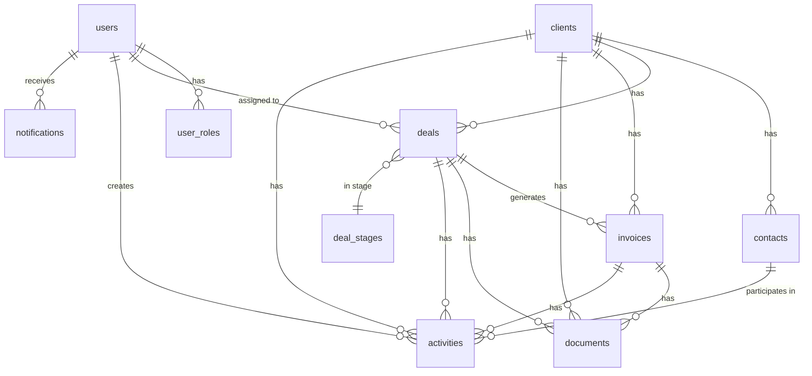

# 🗄️ AMO AI CRM - Database Schema Design

**Version:** 1.0  
**Date:** January 6, 2025  
**Status:** Design Phase

---

## 📋 Schema Overview

The CRM database consists of 12 core tables with comprehensive relationships, RLS policies, and audit tracking.

### Entity Relationship Diagram



---

## 📊 Table Definitions

### 1. clients

Stores company/organization information.

```sql
CREATE TABLE public.clients (
  id UUID PRIMARY KEY DEFAULT gen_random_uuid(),
  name TEXT NOT NULL,
  company_name TEXT NOT NULL,
  email TEXT,
  phone TEXT,
  website TEXT,
  industry TEXT,
  company_size TEXT CHECK (company_size IN ('1-10', '11-50', '51-200', '201-500', '500+')),
  status TEXT NOT NULL DEFAULT 'active' CHECK (status IN ('active', 'inactive', 'prospect', 'archived')),
  address_line1 TEXT,
  address_line2 TEXT,
  city TEXT,
  state TEXT,
  postal_code TEXT,
  country TEXT DEFAULT 'USA',
  notes TEXT,
  tags TEXT[], -- Array of tags for categorization
  lifetime_value DECIMAL(10,2) DEFAULT 0,
  assigned_to UUID REFERENCES auth.users(id),
  created_by UUID REFERENCES auth.users(id),
  created_at TIMESTAMPTZ NOT NULL DEFAULT NOW(),
  updated_at TIMESTAMPTZ NOT NULL DEFAULT NOW()
);

-- Indexes
CREATE INDEX idx_clients_status ON public.clients(status);
CREATE INDEX idx_clients_industry ON public.clients(industry);
CREATE INDEX idx_clients_assigned_to ON public.clients(assigned_to);
CREATE INDEX idx_clients_created_at ON public.clients(created_at DESC);

-- Updated at trigger
CREATE TRIGGER update_clients_updated_at
  BEFORE UPDATE ON public.clients
  FOR EACH ROW
  EXECUTE FUNCTION update_updated_at_column();
```

---

### 2. contacts

Individual people at client companies.

```sql
CREATE TABLE public.contacts (
  id UUID PRIMARY KEY DEFAULT gen_random_uuid(),
  client_id UUID NOT NULL REFERENCES public.clients(id) ON DELETE CASCADE,
  first_name TEXT NOT NULL,
  last_name TEXT NOT NULL,
  email TEXT NOT NULL,
  phone TEXT,
  mobile TEXT,
  job_title TEXT,
  department TEXT,
  is_primary BOOLEAN DEFAULT FALSE,
  linkedin_url TEXT,
  notes TEXT,
  status TEXT DEFAULT 'active' CHECK (status IN ('active', 'inactive')),
  created_by UUID REFERENCES auth.users(id),
  created_at TIMESTAMPTZ NOT NULL DEFAULT NOW(),
  updated_at TIMESTAMPTZ NOT NULL DEFAULT NOW(),
  
  CONSTRAINT unique_client_email UNIQUE (client_id, email)
);

-- Indexes
CREATE INDEX idx_contacts_client_id ON public.contacts(client_id);
CREATE INDEX idx_contacts_email ON public.contacts(email);
CREATE INDEX idx_contacts_is_primary ON public.contacts(is_primary) WHERE is_primary = TRUE;

-- Updated at trigger
CREATE TRIGGER update_contacts_updated_at
  BEFORE UPDATE ON public.contacts
  FOR EACH ROW
  EXECUTE FUNCTION update_updated_at_column();
```

---

### 3. deals

Sales opportunities and pipeline management.

```sql
CREATE TABLE public.deals (
  id UUID PRIMARY KEY DEFAULT gen_random_uuid(),
  client_id UUID NOT NULL REFERENCES public.clients(id) ON DELETE CASCADE,
  deal_name TEXT NOT NULL,
  deal_value DECIMAL(10,2) NOT NULL CHECK (deal_value >= 0),
  currency TEXT DEFAULT 'USD',
  stage TEXT NOT NULL DEFAULT 'lead' CHECK (stage IN ('lead', 'qualified', 'proposal', 'negotiation', 'won', 'lost')),
  probability INTEGER DEFAULT 0 CHECK (probability >= 0 AND probability <= 100),
  expected_close_date DATE,
  actual_close_date DATE,
  loss_reason TEXT, -- If deal is lost
  description TEXT,
  notes TEXT,
  assigned_to UUID REFERENCES auth.users(id),
  created_by UUID REFERENCES auth.users(id),
  created_at TIMESTAMPTZ NOT NULL DEFAULT NOW(),
  updated_at TIMESTAMPTZ NOT NULL DEFAULT NOW(),
  
  -- Source tracking
  source TEXT CHECK (source IN ('website', 'referral', 'brief_wizard', 'cold_outreach', 'inbound', 'partner')),
  source_detail TEXT,
  
  -- AI fields
  ai_score INTEGER CHECK (ai_score >= 0 AND ai_score <= 100), -- AI-predicted win probability
  ai_insights JSONB -- AI-generated insights
);

-- Indexes
CREATE INDEX idx_deals_client_id ON public.deals(client_id);
CREATE INDEX idx_deals_stage ON public.deals(stage);
CREATE INDEX idx_deals_assigned_to ON public.deals(assigned_to);
CREATE INDEX idx_deals_expected_close_date ON public.deals(expected_close_date);
CREATE INDEX idx_deals_created_at ON public.deals(created_at DESC);

-- Updated at trigger
CREATE TRIGGER update_deals_updated_at
  BEFORE UPDATE ON public.deals
  FOR EACH ROW
  EXECUTE FUNCTION update_updated_at_column();

-- Auto-update actual_close_date when deal is won/lost
CREATE OR REPLACE FUNCTION update_deal_close_date()
RETURNS TRIGGER AS $$
BEGIN
  IF NEW.stage IN ('won', 'lost') AND OLD.stage NOT IN ('won', 'lost') THEN
    NEW.actual_close_date = CURRENT_DATE;
  END IF;
  RETURN NEW;
END;
$$ LANGUAGE plpgsql;

CREATE TRIGGER set_deal_close_date
  BEFORE UPDATE ON public.deals
  FOR EACH ROW
  EXECUTE FUNCTION update_deal_close_date();
```

---

### 4. invoices

Billing and payment tracking.

```sql
CREATE TABLE public.invoices (
  id UUID PRIMARY KEY DEFAULT gen_random_uuid(),
  invoice_number TEXT NOT NULL UNIQUE,
  client_id UUID NOT NULL REFERENCES public.clients(id) ON DELETE CASCADE,
  deal_id UUID REFERENCES public.deals(id) ON DELETE SET NULL,
  amount DECIMAL(10,2) NOT NULL CHECK (amount >= 0),
  currency TEXT DEFAULT 'USD',
  status TEXT NOT NULL DEFAULT 'draft' CHECK (status IN ('draft', 'sent', 'paid', 'overdue', 'cancelled')),
  issue_date DATE NOT NULL DEFAULT CURRENT_DATE,
  due_date DATE NOT NULL,
  paid_date DATE,
  payment_method TEXT CHECK (payment_method IN ('stripe', 'bank_transfer', 'check', 'cash', 'other')),
  payment_reference TEXT, -- Stripe payment ID, check number, etc.
  description TEXT,
  notes TEXT,
  pdf_url TEXT, -- Link to stored PDF in Supabase Storage
  created_by UUID REFERENCES auth.users(id),
  created_at TIMESTAMPTZ NOT NULL DEFAULT NOW(),
  updated_at TIMESTAMPTZ NOT NULL DEFAULT NOW()
);

-- Indexes
CREATE INDEX idx_invoices_client_id ON public.invoices(client_id);
CREATE INDEX idx_invoices_deal_id ON public.invoices(deal_id);
CREATE INDEX idx_invoices_status ON public.invoices(status);
CREATE INDEX idx_invoices_due_date ON public.invoices(due_date);
CREATE INDEX idx_invoices_invoice_number ON public.invoices(invoice_number);

-- Updated at trigger
CREATE TRIGGER update_invoices_updated_at
  BEFORE UPDATE ON public.invoices
  FOR EACH ROW
  EXECUTE FUNCTION update_updated_at_column();

-- Auto-set paid_date when status changes to paid
CREATE OR REPLACE FUNCTION update_invoice_paid_date()
RETURNS TRIGGER AS $$
BEGIN
  IF NEW.status = 'paid' AND OLD.status != 'paid' THEN
    NEW.paid_date = CURRENT_DATE;
  END IF;
  RETURN NEW;
END;
$$ LANGUAGE plpgsql;

CREATE TRIGGER set_invoice_paid_date
  BEFORE UPDATE ON public.invoices
  FOR EACH ROW
  EXECUTE FUNCTION update_invoice_paid_date();
```

---

### 5. documents

File attachments for clients, deals, invoices.

```sql
CREATE TABLE public.documents (
  id UUID PRIMARY KEY DEFAULT gen_random_uuid(),
  file_name TEXT NOT NULL,
  file_size BIGINT, -- Bytes
  file_type TEXT, -- MIME type
  storage_path TEXT NOT NULL, -- Path in Supabase Storage
  public_url TEXT, -- Public URL if applicable
  
  -- Polymorphic relationship
  entity_type TEXT NOT NULL CHECK (entity_type IN ('client', 'deal', 'invoice', 'contact')),
  entity_id UUID NOT NULL,
  
  description TEXT,
  uploaded_by UUID REFERENCES auth.users(id),
  created_at TIMESTAMPTZ NOT NULL DEFAULT NOW()
);

-- Indexes
CREATE INDEX idx_documents_entity ON public.documents(entity_type, entity_id);
CREATE INDEX idx_documents_uploaded_by ON public.documents(uploaded_by);
CREATE INDEX idx_documents_created_at ON public.documents(created_at DESC);
```

---

### 6. activities

Activity log and timeline for all entities.

```sql
CREATE TABLE public.activities (
  id UUID PRIMARY KEY DEFAULT gen_random_uuid(),
  activity_type TEXT NOT NULL CHECK (activity_type IN (
    'note', 'email', 'call', 'meeting', 'task', 'status_change', 'file_upload', 'system'
  )),
  subject TEXT,
  description TEXT,
  
  -- Polymorphic relationship
  entity_type TEXT NOT NULL CHECK (entity_type IN ('client', 'deal', 'invoice', 'contact')),
  entity_id UUID NOT NULL,
  
  -- Additional relationships
  contact_id UUID REFERENCES public.contacts(id) ON DELETE SET NULL, -- If activity involves a contact
  
  -- Metadata
  metadata JSONB, -- Additional flexible data
  
  -- User tracking
  created_by UUID REFERENCES auth.users(id),
  created_at TIMESTAMPTZ NOT NULL DEFAULT NOW()
);

-- Indexes
CREATE INDEX idx_activities_entity ON public.activities(entity_type, entity_id);
CREATE INDEX idx_activities_created_at ON public.activities(created_at DESC);
CREATE INDEX idx_activities_type ON public.activities(activity_type);
CREATE INDEX idx_activities_created_by ON public.activities(created_by);
```

---

### 7. user_roles

User permission management (CRITICAL SECURITY).

```sql
-- Create role enum
CREATE TYPE public.app_role AS ENUM ('admin', 'sales', 'viewer');

-- User roles table
CREATE TABLE public.user_roles (
  id UUID PRIMARY KEY DEFAULT gen_random_uuid(),
  user_id UUID NOT NULL REFERENCES auth.users(id) ON DELETE CASCADE,
  role app_role NOT NULL,
  created_at TIMESTAMPTZ NOT NULL DEFAULT NOW(),
  
  UNIQUE (user_id, role)
);

-- Index
CREATE INDEX idx_user_roles_user_id ON public.user_roles(user_id);

-- Security definer function to check roles
CREATE OR REPLACE FUNCTION public.has_role(_user_id UUID, _role app_role)
RETURNS BOOLEAN
LANGUAGE SQL
STABLE
SECURITY DEFINER
SET search_path = public
AS $$
  SELECT EXISTS (
    SELECT 1
    FROM public.user_roles
    WHERE user_id = _user_id AND role = _role
  )
$$;

-- Helper function to check if user is admin
CREATE OR REPLACE FUNCTION public.is_admin(_user_id UUID)
RETURNS BOOLEAN
LANGUAGE SQL
STABLE
SECURITY DEFINER
SET search_path = public
AS $$
  SELECT public.has_role(_user_id, 'admin')
$$;
```

---

### 8. notifications

System notifications for users.

```sql
CREATE TABLE public.notifications (
  id UUID PRIMARY KEY DEFAULT gen_random_uuid(),
  user_id UUID NOT NULL REFERENCES auth.users(id) ON DELETE CASCADE,
  title TEXT NOT NULL,
  message TEXT,
  type TEXT CHECK (type IN ('info', 'success', 'warning', 'error')),
  is_read BOOLEAN DEFAULT FALSE,
  action_url TEXT, -- Link to relevant page
  created_at TIMESTAMPTZ NOT NULL DEFAULT NOW()
);

-- Indexes
CREATE INDEX idx_notifications_user_id ON public.notifications(user_id);
CREATE INDEX idx_notifications_is_read ON public.notifications(is_read) WHERE is_read = FALSE;
CREATE INDEX idx_notifications_created_at ON public.notifications(created_at DESC);
```

---

### 9. deal_stages (Configuration)

```sql
CREATE TABLE public.deal_stages (
  id UUID PRIMARY KEY DEFAULT gen_random_uuid(),
  name TEXT NOT NULL UNIQUE,
  display_order INTEGER NOT NULL,
  probability INTEGER DEFAULT 0 CHECK (probability >= 0 AND probability <= 100),
  is_active BOOLEAN DEFAULT TRUE,
  color TEXT, -- Hex color for UI
  created_at TIMESTAMPTZ NOT NULL DEFAULT NOW()
);

-- Seed default stages
INSERT INTO public.deal_stages (name, display_order, probability, color) VALUES
  ('lead', 1, 10, '#6366f1'),
  ('qualified', 2, 25, '#8b5cf6'),
  ('proposal', 3, 50, '#ec4899'),
  ('negotiation', 4, 75, '#f59e0b'),
  ('won', 5, 100, '#10b981'),
  ('lost', 6, 0, '#ef4444');
```

---

### 10. industries (Configuration)

```sql
CREATE TABLE public.industries (
  id UUID PRIMARY KEY DEFAULT gen_random_uuid(),
  name TEXT NOT NULL UNIQUE,
  created_at TIMESTAMPTZ NOT NULL DEFAULT NOW()
);

-- Seed common industries
INSERT INTO public.industries (name) VALUES
  ('Technology'),
  ('Healthcare'),
  ('Finance'),
  ('E-commerce'),
  ('Education'),
  ('Manufacturing'),
  ('Real Estate'),
  ('Consulting'),
  ('Marketing'),
  ('Other');
```

---

### 11. email_templates

Reusable email templates for automation.

```sql
CREATE TABLE public.email_templates (
  id UUID PRIMARY KEY DEFAULT gen_random_uuid(),
  name TEXT NOT NULL UNIQUE,
  subject TEXT NOT NULL,
  body_html TEXT NOT NULL,
  body_text TEXT,
  variables JSONB, -- List of available variables
  category TEXT CHECK (category IN ('notification', 'marketing', 'transactional')),
  is_active BOOLEAN DEFAULT TRUE,
  created_by UUID REFERENCES auth.users(id),
  created_at TIMESTAMPTZ NOT NULL DEFAULT NOW(),
  updated_at TIMESTAMPTZ NOT NULL DEFAULT NOW()
);

-- Updated at trigger
CREATE TRIGGER update_email_templates_updated_at
  BEFORE UPDATE ON public.email_templates
  FOR EACH ROW
  EXECUTE FUNCTION update_updated_at_column();
```

---

### 12. audit_log

Complete audit trail of all system actions.

```sql
CREATE TABLE public.audit_log (
  id UUID PRIMARY KEY DEFAULT gen_random_uuid(),
  table_name TEXT NOT NULL,
  record_id UUID NOT NULL,
  action TEXT NOT NULL CHECK (action IN ('INSERT', 'UPDATE', 'DELETE')),
  old_data JSONB,
  new_data JSONB,
  changed_fields TEXT[],
  user_id UUID REFERENCES auth.users(id),
  ip_address INET,
  user_agent TEXT,
  created_at TIMESTAMPTZ NOT NULL DEFAULT NOW()
);

-- Indexes
CREATE INDEX idx_audit_log_table_record ON public.audit_log(table_name, record_id);
CREATE INDEX idx_audit_log_user_id ON public.audit_log(user_id);
CREATE INDEX idx_audit_log_created_at ON public.audit_log(created_at DESC);
```

---

## 🔐 Row-Level Security (RLS) Policies

### Enable RLS on all tables

```sql
ALTER TABLE public.clients ENABLE ROW LEVEL SECURITY;
ALTER TABLE public.contacts ENABLE ROW LEVEL SECURITY;
ALTER TABLE public.deals ENABLE ROW LEVEL SECURITY;
ALTER TABLE public.invoices ENABLE ROW LEVEL SECURITY;
ALTER TABLE public.documents ENABLE ROW LEVEL SECURITY;
ALTER TABLE public.activities ENABLE ROW LEVEL SECURITY;
ALTER TABLE public.user_roles ENABLE ROW LEVEL SECURITY;
ALTER TABLE public.notifications ENABLE ROW LEVEL SECURITY;
ALTER TABLE public.email_templates ENABLE ROW LEVEL SECURITY;
ALTER TABLE public.audit_log ENABLE ROW LEVEL SECURITY;
```

### Clients RLS Policies

```sql
-- Admins can do everything
CREATE POLICY "Admins have full access to clients"
  ON public.clients
  FOR ALL
  USING (public.is_admin(auth.uid()));

-- Sales can view and edit clients assigned to them
CREATE POLICY "Sales can view their assigned clients"
  ON public.clients
  FOR SELECT
  USING (
    public.has_role(auth.uid(), 'sales') AND
    (assigned_to = auth.uid() OR assigned_to IS NULL)
  );

CREATE POLICY "Sales can insert clients"
  ON public.clients
  FOR INSERT
  WITH CHECK (public.has_role(auth.uid(), 'sales'));

CREATE POLICY "Sales can update their assigned clients"
  ON public.clients
  FOR UPDATE
  USING (
    public.has_role(auth.uid(), 'sales') AND
    assigned_to = auth.uid()
  );

-- Viewers can only view
CREATE POLICY "Viewers can view active clients"
  ON public.clients
  FOR SELECT
  USING (
    public.has_role(auth.uid(), 'viewer') AND
    status = 'active'
  );
```

### Similar RLS patterns for all other tables

*See `02-auth-security.md` for complete RLS policy definitions*

---

## 📊 Sample Data

### Example Client

```sql
INSERT INTO public.clients (name, company_name, email, industry, status) VALUES
  ('Tech Startup Inc', 'Tech Startup', 'contact@techstartup.com', 'Technology', 'active');
```

### Example Deal

```sql
INSERT INTO public.deals (client_id, deal_name, deal_value, stage) VALUES
  ((SELECT id FROM public.clients WHERE company_name = 'Tech Startup'), 
   'Website Redesign', 
   45000, 
   'proposal');
```

---

## 🔧 Utility Functions

### Update Updated At Column

```sql
CREATE OR REPLACE FUNCTION update_updated_at_column()
RETURNS TRIGGER AS $$
BEGIN
  NEW.updated_at = NOW();
  RETURN NEW;
END;
$$ LANGUAGE plpgsql;
```

---

**Next Document:** [02-auth-security.md](./02-auth-security.md)

**Status:** ✅ Ready for Implementation
