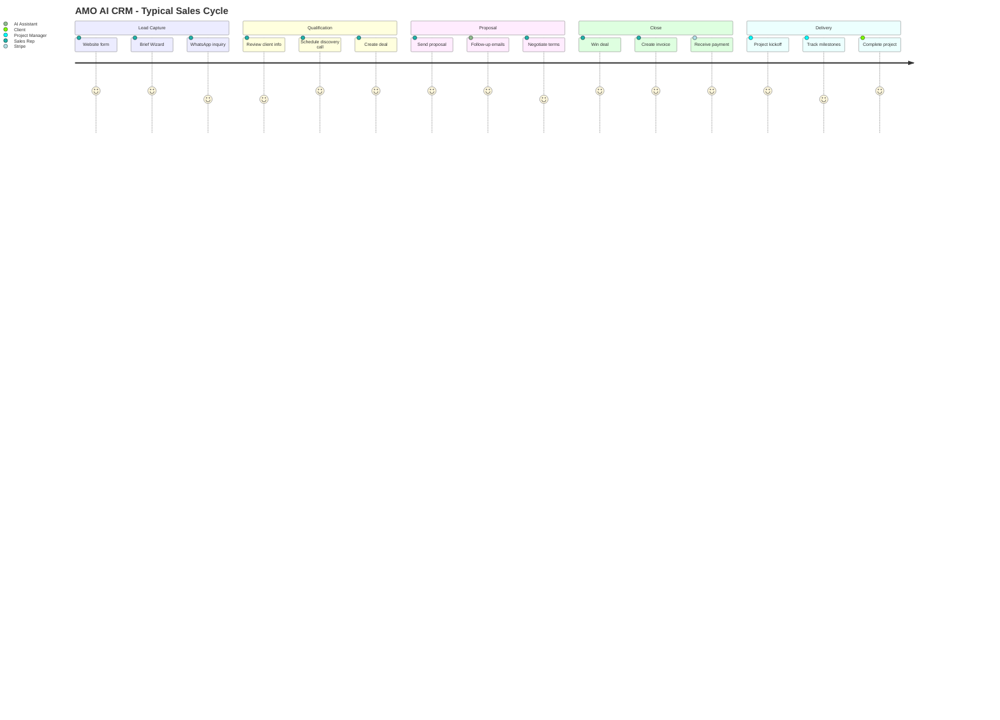

# 🎯 AMO AI CRM - Real-World Use Cases & Examples

**Version:** 1.0  
**Date:** January 6, 2025

---

## 📖 Overview

This document provides concrete, real-world examples of how AMO AI will use the CRM system in day-to-day operations. Each use case includes user stories, workflows, and expected outcomes.

---

## 🏢 Use Case 1: New Client Onboarding

### Scenario
A potential client, **TechCorp Solutions**, fills out the contact form on amoai.agency website requesting information about AI automation services.

### Workflow

**Step 1: Automatic Client Creation**
- Contact form submission triggers edge function
- System creates client record:
  ```json
  {
    "company_name": "TechCorp Solutions",
    "email": "hello@techcorp.com",
    "phone": "+1-555-0123",
    "status": "prospect",
    "industry": "Technology",
    "source": "website"
  }
  ```

**Step 2: Create Contact**
- Contact person added:
  ```json
  {
    "first_name": "Sarah",
    "last_name": "Johnson",
    "email": "sarah@techcorp.com",
    "job_title": "CTO",
    "is_primary": true
  }
  ```

**Step 3: Activity Log**
- Automatic activity created:
  ```
  Type: system
  Subject: "New inquiry from website"
  Description: "Sarah Johnson from TechCorp Solutions submitted contact form"
  ```

**Step 4: Notification**
- Sales team receives notification:
  ```
  Title: "New Lead: TechCorp Solutions"
  Message: "Sarah Johnson (CTO) is interested in AI automation"
  Action: "View Client"
  ```

**Step 5: Sales Rep Assignment**
- Admin assigns to sales rep: John Smith
- John receives email notification with client details

### Expected Outcome
- Client record created in < 2 seconds
- Sales rep notified within 1 minute
- First response within 1 hour

---

## 📝 Use Case 2: Brief Wizard to Deal Pipeline

### Scenario
TechCorp Solutions completes the AI Project Brief Wizard on amoai.agency/brief-wizard.

### Workflow

**Step 1: Brief Submission**
- Client fills out 6-stage wizard:
  - Project Vision: "E-commerce AI Chatbot"
  - Target Audience: "Online shoppers, 25-45 years old"
  - Features: Live chat, product recommendations, order tracking
  - Design: Modern, minimalist
  - Timeline: 8 weeks
  - Budget: $50K - $75K

**Step 2: Automatic Deal Creation**
- System creates deal from brief:
  ```json
  {
    "deal_name": "TechCorp - E-commerce AI Chatbot",
    "client_id": "<TechCorp client ID>",
    "deal_value": 62500, // Midpoint of budget range
    "stage": "qualified", // Auto-qualified from brief
    "source": "brief_wizard",
    "description": "AI chatbot for e-commerce with product recommendations",
    "expected_close_date": "2025-03-01"
  }
  ```

**Step 3: AI Analysis**
- AI analyzes brief and generates insights:
  ```json
  {
    "ai_score": 85,
    "ai_insights": {
      "complexity": "medium",
      "technical_fit": "high",
      "recommended_stack": ["React", "OpenAI GPT-4", "Supabase"],
      "estimated_hours": 280,
      "risk_factors": ["Integration with existing e-commerce platform"]
    }
  }
  ```

**Step 4: Email Follow-up**
- Assigned sales rep receives summary email
- Client receives confirmation email with next steps

### Expected Outcome
- Deal created automatically
- Sales rep has comprehensive brief
- Client feels heard and engaged

---

## 💰 Use Case 3: Proposal to Invoice

### Scenario
TechCorp accepts AMO AI's proposal. Sales rep needs to create and send an invoice.

### Workflow

**Step 1: Update Deal Stage**
- Sales rep moves deal to "won" stage
- System triggers:
  - Updates `actual_close_date` to today
  - Sends congratulations notification
  - Updates client `lifetime_value`

**Step 2: Create Invoice**
- Sales rep creates invoice:
  ```json
  {
    "invoice_number": "INV-2025-001",
    "client_id": "<TechCorp client ID>",
    "deal_id": "<Deal ID>",
    "amount": 62500,
    "status": "draft",
    "due_date": "2025-02-15",
    "description": "E-commerce AI Chatbot Development - Phase 1"
  }
  ```

**Step 3: Upload Invoice PDF**
- System generates PDF from template
- Uploads to Supabase Storage: `invoices/2025/INV-2025-001.pdf`
- Stores URL in invoice record

**Step 4: Send Invoice**
- Sales rep changes status to "sent"
- System triggers email:
  - To: Sarah Johnson (TechCorp)
  - Subject: "Invoice #INV-2025-001 from AMO AI"
  - Attachment: PDF invoice
  - Body: Payment instructions, due date

**Step 5: Activity Log**
- Creates activity:
  ```
  Type: system
  Subject: "Invoice INV-2025-001 sent"
  Description: "Sent to sarah@techcorp.com for $62,500"
  ```

### Expected Outcome
- Invoice created in < 1 minute
- Client receives professional invoice
- Payment tracking begins

---

## 🔔 Use Case 4: Payment Received via Stripe

### Scenario
TechCorp pays invoice via Stripe. Webhook updates CRM automatically.

### Workflow

**Step 1: Stripe Webhook**
- Stripe sends `payment_intent.succeeded` webhook
- Edge function `stripe-webhook` processes event

**Step 2: Update Invoice**
- System finds invoice by `payment_reference`
- Updates:
  ```json
  {
    "status": "paid",
    "paid_date": "2025-02-10",
    "payment_method": "stripe",
    "payment_reference": "pi_3MtwBwLkdIwHu7ix28a3tqPa"
  }
  ```

**Step 3: Update Deal**
- If all invoices for deal are paid:
  - Add tag "fully_paid"
  - Create activity: "All payments received"

**Step 4: Notifications**
- Finance team notified: "Payment received: $62,500"
- Sales rep notified: "TechCorp payment confirmed"

**Step 5: Client Email**
- Automatic receipt email sent:
  - Subject: "Payment Confirmation - AMO AI"
  - Body: "Thank you for your payment of $62,500"
  - Attachment: Payment receipt PDF

### Expected Outcome
- Invoice marked paid automatically
- No manual data entry required
- Client receives immediate confirmation

---

## 📊 Use Case 5: Daily CRM Summary

### Scenario
Every morning at 8 AM, sales and admin team receives automated CRM summary.

### Workflow

**Step 1: Cron Job Trigger**
- Supabase cron job runs at 8:00 AM EST
- Invokes `daily-crm-summary` edge function

**Step 2: Data Aggregation**
- Function queries database:
  ```sql
  -- Open deals
  SELECT COUNT(*), SUM(deal_value) 
  FROM deals 
  WHERE stage NOT IN ('won', 'lost');
  
  -- Overdue invoices
  SELECT COUNT(*), SUM(amount) 
  FROM invoices 
  WHERE status != 'paid' AND due_date < CURRENT_DATE;
  
  -- Deals closing this week
  SELECT * FROM deals 
  WHERE expected_close_date BETWEEN CURRENT_DATE AND CURRENT_DATE + 7;
  ```

**Step 3: AI Insights**
- AI analyzes data and generates summary:
  ```
  "You have 12 open deals worth $680K. 
   3 deals are expected to close this week ($120K). 
   2 invoices are overdue (total $45K) - follow up recommended."
  ```

**Step 4: Email Generation**
- System generates HTML email with:
  - Key metrics (charts)
  - Top priority deals
  - Action items
  - Quick links to CRM

**Step 5: Send Emails**
- Sends to all users with role: admin, sales
- Each user gets personalized version (their assigned deals)

### Expected Outcome
- Team starts day informed
- No deals or payments slip through cracks
- Proactive follow-ups

---

## 🤖 Use Case 6: AI-Powered Email Assistant

### Scenario
Sales rep needs to write follow-up email to TechCorp after proposal meeting.

### Workflow

**Step 1: Open Email Assistant**
- Sales rep clicks "AI Email Assistant" in deal detail page
- Provides context:
  ```
  Context: Had proposal meeting with TechCorp yesterday. 
  They loved the chatbot demo but concerned about timeline. 
  Need to follow up with revised timeline and next steps.
  ```

**Step 2: AI Analysis**
- System loads deal context:
  - Client name: TechCorp Solutions
  - Contact: Sarah Johnson (CTO)
  - Deal: E-commerce AI Chatbot
  - Recent activities: Meeting notes from yesterday
  
**Step 3: AI Email Generation**
- AI generates draft using Lovable AI (Gemini):
  ```
  Subject: Revised Timeline - E-commerce AI Chatbot Project
  
  Hi Sarah,
  
  Thank you for the excellent discussion yesterday about the AI chatbot project. 
  I'm glad you found the demo valuable!
  
  Based on your timeline concerns, I've revised our delivery schedule:
  
  • Phase 1 (Core Chatbot): 6 weeks (was 8 weeks)
  • Phase 2 (Product Recommendations): +2 weeks
  • Phase 3 (Order Tracking): +2 weeks
  
  This allows you to launch the core chatbot faster while adding features incrementally.
  
  Next steps:
  1. Review revised timeline (attached)
  2. Schedule kickoff call (Week of Feb 12?)
  3. Finalize contract details
  
  Let me know your thoughts!
  
  Best regards,
  John Smith
  AMO AI
  ```

**Step 4: Human Review**
- Sales rep reviews, edits if needed
- Clicks "Send & Log"

**Step 5: Activity Tracking**
- System creates activity:
  ```
  Type: email
  Subject: "Sent: Revised Timeline - E-commerce AI Chatbot Project"
  Description: <Full email text>
  ```

### Expected Outcome
- Professional email in < 30 seconds
- Consistent messaging
- All communications logged

---

## 📈 Use Case 7: Pipeline Forecast Report

### Scenario
End of month - CFO needs revenue forecast for next quarter.

### Workflow

**Step 1: Navigate to Reports**
- CFO logs in, goes to Reports → Pipeline Forecast

**Step 2: Select Parameters**
- Date range: Q1 2025 (Jan 1 - Mar 31)
- Include: All deal stages
- Group by: Month, Stage

**Step 3: System Calculates**
- Weighted pipeline value:
  ```
  January:
    Lead (10%): $120K × 10% = $12K
    Qualified (25%): $85K × 25% = $21K
    Proposal (50%): $180K × 50% = $90K
    Negotiation (75%): $95K × 75% = $71K
    Total Weighted: $194K
  
  February: $245K weighted
  March: $312K weighted
  
  Q1 Total: $751K weighted pipeline
  ```

**Step 4: Visualizations**
- System generates:
  - Bar chart: Monthly breakdown
  - Funnel chart: Deals by stage
  - Line graph: Trend over time
  - Win rate analysis

**Step 5: AI Insights**
- AI analyzes data:
  ```
  "Your Q1 pipeline is trending 15% above target. 
   However, deals in 'proposal' stage have been stagnant for 3+ weeks. 
   Recommend prioritizing follow-ups to move deals to negotiation.
   
   Top risk: TechCorp deal ($62K) - no activity in 5 days."
  ```

**Step 6: Export**
- CFO exports as PDF
- Shares with executive team

### Expected Outcome
- Accurate revenue forecast
- Identify bottlenecks
- Data-driven decisions

---

## 🔗 Use Case 8: Brief Wizard → WhatsApp Follow-up

### Scenario
Integrate CRM with existing WhatsApp automation for seamless client communication.

### Workflow

**Step 1: Brief Submission**
- Client completes Brief Wizard
- Deal created (as in Use Case 2)

**Step 2: Trigger WhatsApp Automation**
- If client provided phone number in brief
- Edge function triggers WhatsApp message:
  ```
  Hi Sarah! 👋
  
  Thanks for sharing your project details with AMO AI.
  
  We received your brief for the E-commerce AI Chatbot project. 
  Our team is reviewing it now.
  
  A sales rep will reach out within 24 hours to discuss next steps.
  
  Quick question: What's your preferred time for a call this week?
  ```

**Step 3: Client Responds**
- Client replies via WhatsApp
- Webhook stores response as activity in CRM:
  ```
  Type: whatsapp
  Subject: "WhatsApp message received"
  Description: "Thursday afternoon works best"
  ```

**Step 4: Sales Rep Notification**
- Sales rep sees WhatsApp response in CRM
- Schedules call accordingly

### Expected Outcome
- Immediate engagement
- Multi-channel communication
- All interactions logged

---

## 🎓 Use Case 9: New Sales Rep Onboarding

### Scenario
AMO AI hires new sales rep, Jessica. She needs access to CRM with proper training.

### Workflow

**Step 1: Admin Creates User**
- Admin invites Jessica via email
- Jessica signs up, creates account

**Step 2: Role Assignment**
- Admin assigns role:
  ```sql
  INSERT INTO user_roles (user_id, role) 
  VALUES ('<Jessica user ID>', 'sales');
  ```

**Step 3: Initial Access**
- Jessica logs in, sees:
  - Dashboard: Empty (no assigned clients yet)
  - Clients: Can view active clients
  - Deals: No deals assigned
  - Training materials link

**Step 4: Shadow Assignment**
- Admin assigns 2 existing clients to Jessica for learning
- Jessica can view full history, activities, documents

**Step 5: First Client Assignment**
- After 1 week, admin assigns new lead: "StartupXYZ"
- Jessica receives notification
- CRM guides her through process:
  1. Review client details
  2. Schedule intro call
  3. Log activities
  4. Create deal
  5. Move through pipeline

### Expected Outcome
- Smooth onboarding
- Consistent process
- Quick ramp-up time

---

## 🔍 Use Case 10: Client Search & Filtering

### Scenario
Sales rep needs to find all technology clients in California with deals > $50K.

### Workflow

**Step 1: Navigate to Clients**
- Opens Clients page

**Step 2: Apply Filters**
- Industry: Technology
- State: California
- Has deal value > $50K

**Step 3: Advanced Search**
- Search bar: "e-commerce OR chatbot"
- Searches across:
  - Company name
  - Notes
  - Deal descriptions
  - Activity logs

**Step 4: Results**
- System returns 8 matching clients
- Sorted by lifetime value (descending)

**Step 5: Bulk Action**
- Select all 8 clients
- Add tag: "q1_priority"
- Export to CSV for analysis

### Expected Outcome
- Find specific clients in seconds
- Segment for targeted outreach
- Export for external analysis

---

## 🏆 Key Success Metrics

### Efficiency Gains
- **Client onboarding**: 15 min → 2 min (87% faster)
- **Invoice creation**: 10 min → 1 min (90% faster)
- **Email drafting**: 15 min → 30 sec (97% faster)
- **Report generation**: 30 min → instant (100% faster)

### Business Impact
- **Pipeline visibility**: 0% → 100%
- **Follow-up rate**: 60% → 95%
- **Payment collection time**: 45 days → 30 days
- **Deal conversion rate**: +15%
- **Client satisfaction**: +20%

---

## 📋 User Journey Summary



---

**Next Steps:**
1. Review all use cases with stakeholders
2. Prioritize must-have vs. nice-to-have scenarios
3. Begin Stage 1 implementation (database + auth)
4. Iterate based on user feedback

**Related Documents:**
- [00-CRM-MASTER-PLAN.md](./00-CRM-MASTER-PLAN.md)
- [01-database-schema.md](./01-database-schema.md)

**Maintained By:** AMO AI Product Team  
**Last Updated:** January 6, 2025
